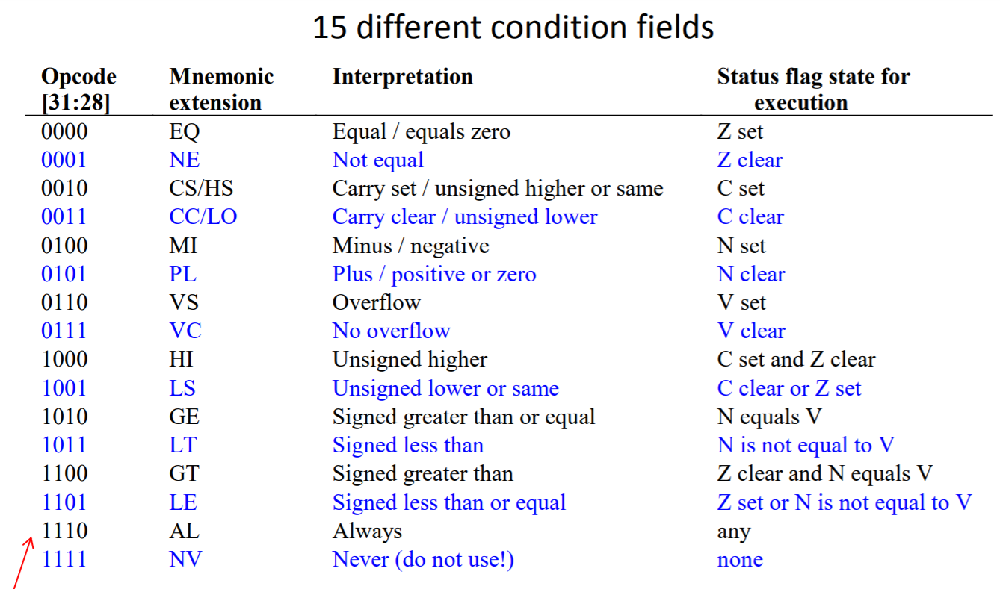

# 嵌入式与微机原理Chapter3

## Flags and Processors

Flag：用来表示特定的事件

- zero flag：用来表示两个数是否相等

- negative flag：用来表示结果是否为负数

- carry flag：用来表示是否进位
- overflow flag：做乘法时是否溢出

SUBS

- 在做减法后，flag会在特定的位置中被设置
- 对于其他指令，只要加上S就会设置flag

### conditional execution

MOVCS r12,#114（CS指的是Carry Set）

如果进位符号是1，就执行MOV命令

指令中前4位总是判断条件的语句

### unconditional branch

在指令中，使用24个bit来指定其branch，就是指定该条指令和目标指令相隔了多少个指令

范围是2^26条指令（由于指令存在内存中，其地址后两位永远是零，所以可以省略，就是用24个bit表示）

一般的，使用zero flag来表示循环

### carry flag

使用ADDS指令，当结果溢出时，carry flag就会设为1

#### ADC

- add with carry flag
- 用于相加的数字大于2^32 - 1
- 如果进位是1，不加另外的数字，如果是0，就将结果加一

## 表示负数

sign magnitude

- 在最高位设置一个符号位

- 如果符号位为0，就是正数

- 如果符号位为1，就是负数

- 其余的表示为正数的表示方法，而不是取补码

MOVS rx,rx用来清楚标志位

如果16进制第一个数大于8，就是负数，否则就是正数

判断是否为负数

- 将目标数和0x7FFFFFFF做与操作

### 麻烦：相加的时候就很麻烦

### 解决方案：使用2的补码

对于正数x，其相反数为-x，定义$2^N-x$为-x在计算机中的值

表示负数的方法

1. 先得到正数的表达形式
2. 将每一位上的数字取反
3. 将取反后的数字加1

在16进制中，就相当于取反

如果添加了两个非常大的数，就可能变成一个负数

通过ADDS：符号位会变成1，但是进位为0

如果两个非常小的负数相加，就会溢出

溢出标志位用来检测是否在第32位（符号位）是否变化

carry flag用来判断第33位是否变化

ARM中，没有减法，所有的减法都是使用的加法取反

负数加正数，overflow就为0

0标志位设为1当结果是0

负标志位为1当结果最高位为1

carry flag为1，当结果大于$2^{32}-1$

overflow flag，设置为1当结果大于$2^{31}-1$或者小于$-2^{31}$

## 表示浮点数

1个符号位，24个数字位，8个指数位

使用科学计数法来表示

数字位上，第一个1被省略

指数位中，添加了固定的offset（对于长度为32bit的数据，添加了127的offset）

- 指数位为0000 0001，则代指的指数为-126
- 指数位为0111 1111，则代指的指数为0
- 指数位为0000 0000不代表-127，被保留了，用于其他用途
- 指数位为1111 1111同理也被保留了，用于其他用途

- 使用0x7F800000为正无穷
- 0xFF800000为负无穷
- 使用指数全1代指NaN

RSB逆向减法