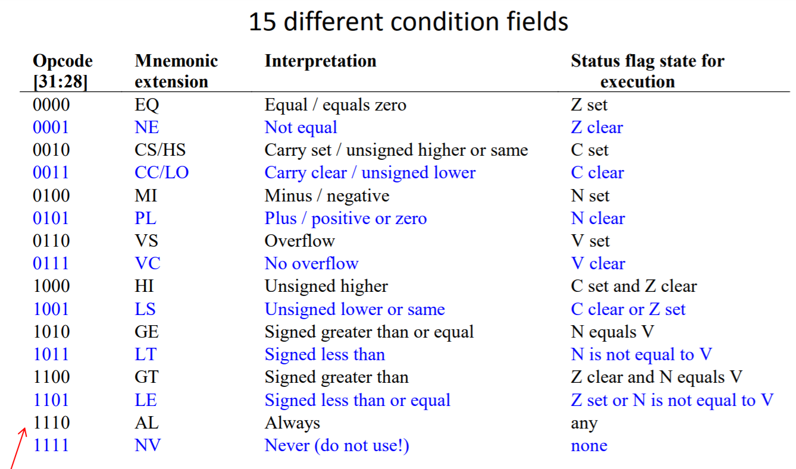

# 嵌入式系统与微机原理Chapter3

## Flags and Processors

Flag：用来表示特定的事件

- zero flag：用来表示两个数是否相等

- negative flag：用来表示结果是否为负数

- carry flag：用来表示是否进位
- overflow flag：做乘法时是否溢出

SUBS

- 在做减法后，flag会在特定的位置中被设置
- 对于其他指令，只要加上S就会设置flag

### conditional execution

MOVCS r12,#114

如果进位符号是1，就执行MOV命令

指令中前4位总是判断条件的语句

### unconditional branch

在指令中，使用24个bit来指定其branch，就是指定该条指令和目标指令相隔了多少个指令

范围是2^26条指令（由于指令存在内存中，其地址后两位永远是零，所以可以省略，就是用24个bit表示）

一般的，使用zero flag来表示循环

### carry flag

使用ADDS指令，当结果溢出时，carry flag就会设为1