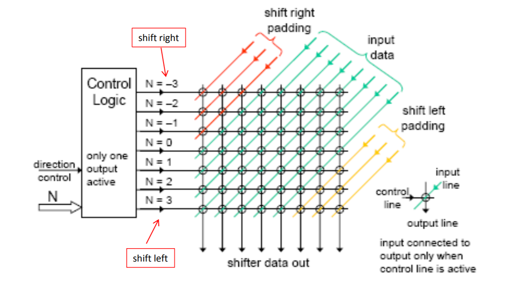

# 嵌入式与微机原理Chapter4

## Subroutine

相当于java中的函数

link register：指明函数的返回方向，用来记录函数返回时指令的地址

r14就是link register，也叫lr

BL：branch and link，用于函数的调用

调用BL时，lr存放的是当前函数的下一跳指令的地址

### 函数的嵌套

当使用递归时，lr的值必须存在一个空间中，不然之前的指令地址会被丢失

引入栈（动态的内存结构），当递归调用时，将返回的地址存在栈中

使用栈指针记录栈的顶部

full stack：指针指向的是最上面的数据

empty stack：指针指向的是最底部的空的位置

empty stack不代表没有数据存放

ascending and descending stack

ascending stack：栈顶的地址比栈底的高

r13：stack pointer

返回到主函数时：

`LDMFD sp!,{pc}`

LDM,STM指的是将一个值赋值给多个寄存器

STMFD sp!,{r6-r9,lr}指的是将r6-r9和lr中的值存到栈中

LDMFD sp!,{r6-r9,pc}指的是将栈中的值pop出来，存放到这些寄存器中

对于栈的操作，pop和push的数量必须要相同，顺序相反

# Barrel Shifter

MOV r1,r2, LSL#5

将r2中的内容向左移动5位，再存到r1中

使用电路进行Barrel Shift

使用shift和add实现multiply

乘64可以表示为 `MOV rx,ry, LSL#6`

乘17可以表示为 `ADD rx,ry,ry,LSL #4`（同理，SUB，RSB也可以用来作为乘法）

