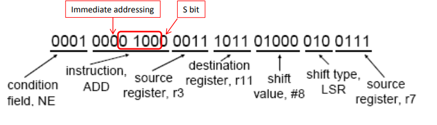
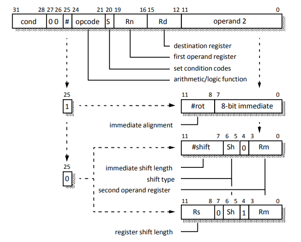
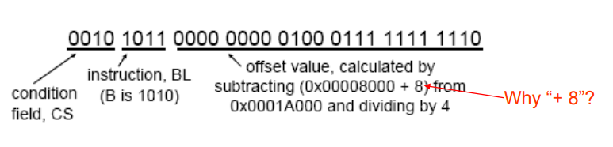
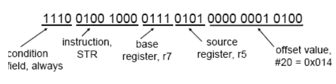
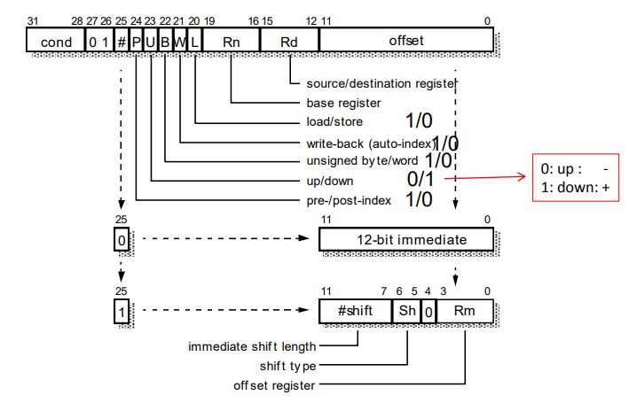
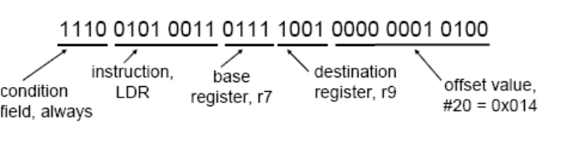
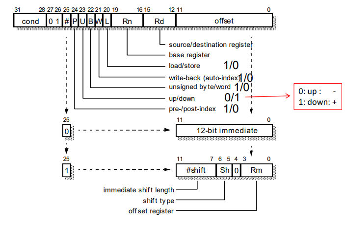
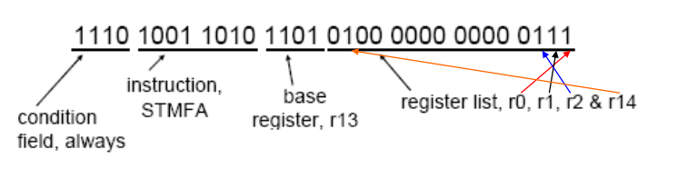
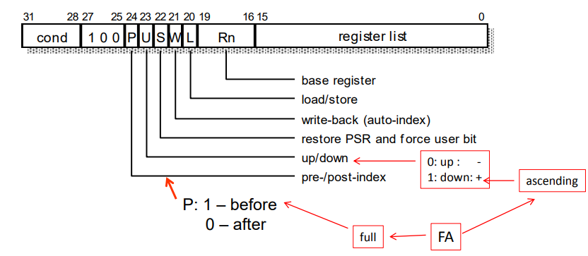

# Lecture 5 Interrupt, Pipeline, and Encoding

## Interrupts

user mode

normal interrupt(IRQ)

fast interrupt(FIQ)

每一个模式下面都有独立的link register和stack pointer

除此之外FIQ的r8和r12也是独立的

### Current Program Status Register

用来存储目前的mode，各种flag

当中断发生时

1. 用于IRQ或者FIQ的寄存器被激活
2. CPSR被存进SPSR中
3. 正常状态下的返回地址被存在link register中
4. pc被设置为0x00000018(IRQ)或者0x0000001C(FIQ)

中断结束时

1. SPSR中的值被放到CPSR中
2. IRQ、FIQ的link register被放到pc中
3. 处理器返回正常模式

## Instruction Pipelines

fetch、decode、execute

branch会使得丢失两个时钟周期

IRQ丢失7个时钟周期（跳转加上branch）

FIQ则为4个

### Pipeline example

ADDNE r11, r3, r7 LSR #8

其机器码为0x1083B427

对于BLCS label，其指令格式为

该指令的execute阶段需要消耗两个额外的时钟周期

第一个时钟周期即根据program counter算出需要加载的地址

第二个时钟周期，PC的值经过ALU被放到了LR中

第三个时钟周期，r14的值自减4并存到r14中

对于STR r5,[r7], #20

需要额外消耗一个时钟周期

第一个时钟周期，address register中的值加了4并存在PC中

同时，r7中的值被放入了address register中

第二个时钟周期，r7中的值增加了20

r5中的值被存进了内存中

PC将里面的值赋给了address register，让他开始下一轮的抓取

LDR r9, [r7,#-20]!

需要额外的两个时钟周期

第一个时钟周期，address register中的值自增4，存在PC中

r7中的值，加上偏移量，存入address register中

第二个时钟周期

有感叹号（代表自增），就将值写进r7

CPU等待数据抓取

第三个时钟周期

抓取到的数据放在了目标寄存器中

PC中的值赋给了address register，用于抽取下一条指令

对于存储，读取多个指令

LDM会花2+n个时钟周期当n个寄存器需要被存储

STM会花1+n个时钟周期

对于STMFA r13!, {r0-r2, r14}

第一个时钟周期

address register自增4，存在PC中

r13自增4，并存在address register中

第二个时钟

r14中的值被存入内存

address register中的值自增4并放到了r13中

第三个时钟

r2中的值被存入内存

address register中的值自增4并存入r13中

同理，r1中的值也存入内存

第五个时钟

r0被存入内存中

pc中的值放入address register中

data bus只会在LDR/LDM的最后一个周期，MUL/MLA的第一个周期中空闲

data forwarding

operand dependency