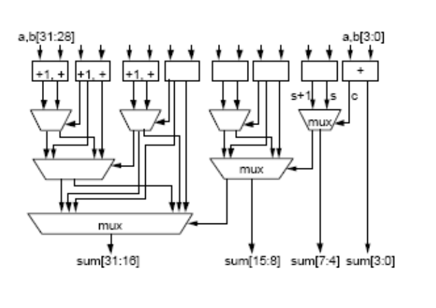

# Lecture 8 Architecture & Components

computer

- Input and output
- Memory
- CPU
  - control circuits
  - instruction decoder
  - arithmetic and logic circuits

将电路变成一个个小的模块-cell

## 加法

full adder

列出真值表即可得出

carry out logic

ARM1 ripple-carry adder circult

添加了一个中间变量，使得延迟降到了1

可以直接应用CMOS中的与或非门，节省了资源

ARM2 4-bit carry look-ahead

每四个为一个单位，进行添加

ARM6 carry select adder

加上了一个选择器

对于32位的加法，分段相加

使用A xor B进行1的补码

加1就变成了基于2的补码

### carry propagate

三个数相加，串行的得到结果

### carry save adder

对于每一位，算出partial sum和partial carry

结果就是S + 2C

## 乘法

规则：分成多步

A*B

- A->multiplicand
- B->multiplier

流程，通过平时的乘法算数进行记忆

1. 将总和设为0
2. 观察multiplier的最低位，如果是1就将multiplicand加到总和里面
3. 将multiplicand左移一位
4. 将multiplier右移一位
5. 重复步骤2直到multiplier为0

### 顺序执行乘法-----Booth's algorithm

负数的乘法也适用

使用了booth算法和carry save，32位的乘法变成了只需要5个时钟周期