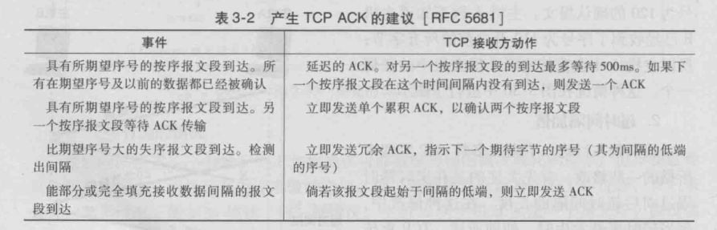
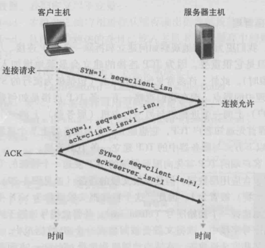
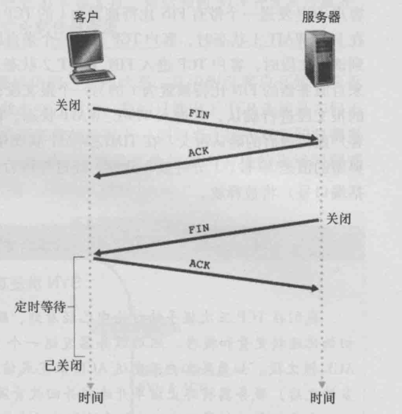

# 计算机网络Chapter3_2

## TCP可靠数据传输

### 计时器

从应用程序接收到数据

- 将数据封装在报文段中

- 传给IP
- 启动计时器

超时

- 重传报文
- 重启定时器

处理ACK

- 将ACK的值y与SendBase变量（最早未被确认的字节的序号，SendBase-1是接收方已正确按序接收到的数据的最后一个字节的序号）进行比较
  - 如果y > SendBase，说明该ACK是在确认一个或多个报文段，就更新SendBase
    - 如果当前有未被确认的报文段，重启定时器

### TCP协议特性

TCP采用了go-back-N的方法

如果timeout

- 只传输导致timeout的数据段
- 重新开始计时

Delay ACK

- 如果接收到一个包，就等一段时间再发送ACK
- 如果在这段时间内接收到了一个包，就立即发送ACK
  - 正确的接收到两个包再发送一个ACK
  - 节省了ACK需要发送的数量

传输ACK包丢失，就不需要管

- 因为此时默认为Cumulative ACK
- 即发送的序号默认ACK前面的都传输完毕

对于Delay ACK，如果发生了丢包（fast retransmit）

- 假设在seq为100的时候发生丢包，且接收到了下一个包（seq为120）
- 立即重传ACK，序列号为100，不传输120
  - 如果接收方没有缓冲，就会发送120的ACK，发送方就会重复以上步骤
  - 如果接收方有缓冲，就发送120+x的ACK，回到正轨
- 接收方收到了若干个seq为100的冗余的ACK（比如说，3个），立即发送丢失的包
  - 这样就不会等到Timeout再发送

Updated ACK

- 在一定的时间范围内没有收到对应的ACK，立即重传，不等冗余的ACK了

fast retransmit

- 如果收到了三个相同的ACK就直接重传

## TCP流量控制（flow control）

发送方和接收方只能猜对方的状态

这里是不想让接收方的缓冲满了

TCP让发送方维护一个接收窗口（Receive window）来提供流量控制

发送端中，使用$RevBuffer$代表接收缓存的大小，$LastByteRead$代表从缓存读出的数据流最后一个字节的编号，$LastByteRevd$从网络中到达的并已放入主机B接收缓存中的数据流的最后一个字节的编号

TCP不允许缓存溢出，所以有
$$
LastByteRevd - LastByteRead \leqslant RevBuffer
$$
则缓存的可用空间为
$$
\text { rwnd }=\text { RevBuffer }-\text { [LastByteRevd - LastByteRead] }
$$
在TCP报文中，专门有一个字节显示rwnd的大小

发送端必须保证
$$
LastByteRevd - LastByteRead \leqslant rwnd
$$
window size代表着接收方能缓冲的最大长度

接收方在发送ACK时告诉发送方减少window size，否则就overflow

接收方测量缓冲区的剩余容量，接近满了就告诉发送方缩小window size

一定要让发送包的大小小于接收方buffer中的空的部分，否则就会溢出

## Connection Management

三次握手只能保证握手建立的过程中运行正确

关闭连接时，先发送FIN，代表关闭连接，接收方发送一个ACK

然后接收方将剩余的数据发送完，释放资源，回一个FIN消息

发送方回应一个ACK，就关闭了连接

## 拥塞控制（Congestion control）

用来处理网络核心中路由器的阻塞

如果有许多数据过来

在网络核心中，不能处理多个包，就溢出了

如果路由器内存不够，就会发送路由器的溢出

单个的路由器溢出，会导致其他路由器一起瘫痪

如果有timeout或者duplit ack，就有congestion control

### 解决方法

涨的时候特别快，问题就很严重，路由器停止工作，不能涨的特别快

降的时候，就要很快，不快就会产生很多丢包

如果发生了丢包，就认为有congestion control

通过发送方的window size控制

一开始设置一个很小的window size，然后不停的测试，如果发生了很多的丢包，就减少window size

指数地增长，当出现了congestion control，就减半，然后线性增长

- 以后就线性增长

普遍增长一个mss

控制sender window大小来控制速率

最大报文段长度（Maximum Segment Size）

- 控制增长的幅度（根据包的大小决定）
- 每一个RTT都增长一个MSS，直到检测到丢包
- 丢包后，window size减半

Slow start

- 一开始的指数增长
- 直到涨到门限值

Tahoe

- 第一个版本的congestion control

- 当发生了timeout（所有的包都接收不了）

- 将congestion window设置为1

RENO

- 后来版本的congestion control

- 如果发生了冗余的包
- congestion window减半

一开始低于门限值就指数地涨

门限值一般设置为1/2的window size

如果想将window size从2变成4，接收到ACK时发送的包就加1

如果window size从2变成8，接收ACK时发送的包就加倍

TCP在很长的时间内会达到相同的吞吐率

决定如何half或者1

- timeout就代表所有的包都没了，接收window就变成1
- dulipcate ack就代表所有的，接收window就减半

flow fairness：

对于两个链路使用congestion control，可以达到平衡，就是平分这个link

设置了多个连接，就会有更高的tcp data rate

Explicit Congestion Notification

典型的TCP不是explicit

路由器阻塞时就发送ECN，这样端系统就能立即知道路由器发生了阻塞

运输层全部在操作系统中实现

关注于网络边缘

网络层在硬件和软件中实现

#### 总结

每一次开始就加1

transport layer：

demultiplexing，multiplexing

rdt

