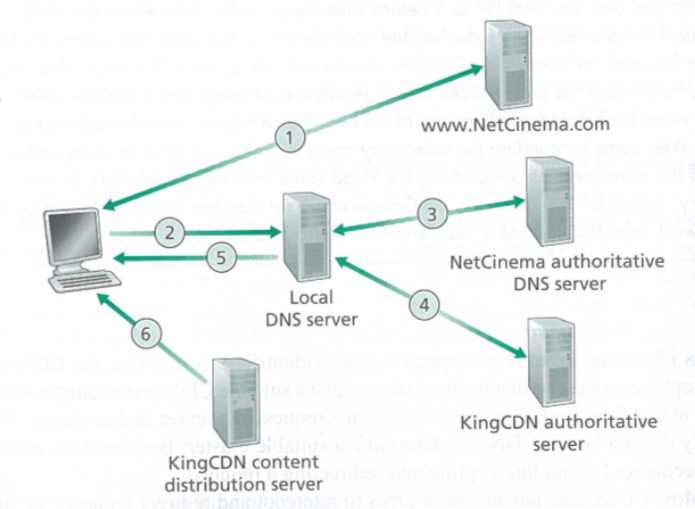

# 计算机网络Chapter2

## Overview

#### 应用程序体系结构

- client-server

- peer-to-peer
  - 自扩展性（self-scalability）
    - 不需要庞大的服务器设施和带宽
  - 任意的端系统都能直接相互联系
  - 只需建立一些连接即可，不需全部建立

#### 进程通信

除了应用层，其余的都有操作系统控制

进行通信实际上是进程（process）

通信方法

- 不同主机之间使用报文（message）进行交互

- 相同的主机使用inter-process communication进行交互

IP：区分不同主机

port number：区分不同进程

提供给应用层的服务

- 数据完整性
  - 保证不会出现数据错误，丢包等操作
- 是否准时
- 吞吐量
- 安全

传输层协议

- 都不能保证吞吐量，延迟

- TCP
  - 接收端的接受速率是一定的，所以发送端的发送速率也是一定的
- UDP
  - 直接发送数据，吞吐量很快

## Web和HTTP

HTML：用来写网页的语言，不是协议

HTTP：是一个网页的协议

HTTP只有两种信息：request和response

网页由对象组成，一个对象就是一个文件

例如：一个web页面包含HTML文本和5个图片，则这个图片通过对象的URL地址来获取（eg：`www.someSchool.edu/picture.gif`）

URL：主机名（host name），路径名（path name）

HTTP只有两种报文：request，response

HTTP

- TCP作为传输协议

- 无状态的（stateless）
  - 不需要关心其之前的请求
  - 对于需要登陆的网站
    - 使用cookies
- 非持续连接（non-persistent HTTP）
  - 在一个连接中，只得到一个对象
  - 同时可以建立多个连接，他们是并行的
  - 快
- 持续连接（persistent HTTP）
  - 一次连接，传输多个对象
  - 节省资源
- 请求报文
  - 请求行（request line）
    - GET方法
      - 代表请求一个对象
    - POST method
      - 发送某个文件
      - 用于提交某个表单，或者输入
    - HEAD方法
      - 类似于GET方法
      - 服务器接收HEAD请求后，会对HTTP报文进行响应，但是不返回请求对象
  - 首部行（head line）
    - Connection：是否使用持续连接
    - User-agent：用户代理，即浏览器的类型
    - Accept-language：发送的语言
- response
  - 首部行（header line）
    - 显示状态码（200，404等）
    - Date：发送响应报文的时间
    - Server：发送报文的服务器名称
    - Last-Modified
    - Content-Length
    - Content-Type
  - 状态行（status line）：
- cookie
  - 用来识别用户的
  - 存在客户端的数据中，其中存放了cookie的识别码
  - cookie的识别码存在后端的数据库中
  - 当客户第一次访问网站，Web就会产生唯一的识别码，存储在数据库中
  - 接下来客户访问网站时，每一次请求都会有携带着cookie
  - 作用
    - 表示一个用户，在没有登陆时建立一个用户会话层
    - 没有隐私
- Web caches
  - 也叫代理服务器（proxy server）
  - 将其中一个服务器放在离客户端很近的地方，作为cache
  - 响应时间就很快
  - 减少流量
- Conditional GET
  - web caches判断网页的内容是否更新
  - 如果更新，就重新接收网页

## E-mail

#### 客户端和服务器之间的通信

SMTP

client process

接收数据的那一方 

server process

发送数据的那一方

#### 服务器和服务器之间的通信

对于客户端发送给服务器，使用SMTP

- 接收方永远在线

对于服务器发送给客户端，使用POP3，IMAP

POP3

- 是一个pull的过程

- 先进行授权：查看账号密码
- 然后就开始transaction
  - 接收信息，删除消息，退出等操作
- 不能创建文件

IMAP

- 在POP3上增加了更多的功能，例如建立邮件文件夹，在文件夹之间移动报文等

对于附件和中文字符，都转换成ASCII，然后传输

通信时，客户端将邮件发送到服务端，服务端将邮件发送到另外一个服务端，然后发送给客户

## HTTP和SMTP的相同点

都是用ASCII编码

### 不同点

HTTP是pull

发送请求后，积极响应 

### HTTP和SMTP的相同点

都是用ASCII编码

### 不同点

HTTP是pull

发送请求后，积极响应 

**客户端有时在线，服务端永远在线**

SMTP是push

主动发送信息

**接收方永远在线**

## DNS

#### Domain Name System

是一个由分成的DNS服务器实现的分布式数据库

一个使得主机能查询分布式数据库的应用层协议

### Domain Name Server

- 用于识别主机，将主机名转换成ip地址
- 主机别名（host aliasing）
  - 访问DNS可以获得主机别名对应的规范主机名以及主机的ip地址
- 邮件服务器别名
- 负载分配

#### root name servers

存放顶级域名的服务器的ip地址

#### local DNS server

存放全部的域名

存放连接该ISP的主机的ip地址

eg：sustech.edu.cn

提供内部的ip地址（ipconfig）

解决外部的响应消息

#### 主机（cis.poly.edu）访问其他主机（gaia.cs.umass.edu）的IP地址流程

- 对于本地的DNS服务器
- 先访问根服务器
- 得到一个具体的DNS服务器地址
- 然后访问这个DNS服务器
- 得到更加具体的DNS服务器
- 依次迭代，从而得到本地DNS服务器
- DNS服务器之间的查询时迭代的（iterated query）
- 主机到DNS服务器之间的查询是递归的（recursive query）

#### DNS caching

在一个请求链中，当某DNS服务器接收一个DNS回答，就会将该回答中的信息缓存在本地存储器中

#### DNS Resource Records

提供了主机名到IP地址的映射

name，value，type，ttl

- ttl
  - 代表该记录的生存时间
  - 过了多久数据就更新，为了保证数据库是实时更新的
- Type
  - A
    - 则Name就是主机名
    - Value代表主机名对应的IP地址
  - NS
    - Name就是一个域
    - Value是知道如何获得该域中主机ip地址的权威DNS服务器的主机名
  - CNAME
    - Value就是别名为Name的主机对应的规范主机名
    - 该记录能够向查询的主机提供一个主机名对应的规范主机名
  - MX
    - Value是名为Name的邮件服务器的规范主机名

一个域名包括了很多个主机名

sustech.edu.cn是域名

www是主机名

服务器分成DNS服务器和用来处理数据的服务器

每一个服务器都有对应的权威服务器

主机访问浏览器时，返回的是最少两条

- 一个是NS，就是访问网站的域名，如果主机名有多个，就返回多条主机名

- 一个是A，包含了ip地址，对于比较大的ISP，相同的域名就会有很多个DNS服务器，也就会有很多个A的记录，如果主机有多个，就返回多个ip地址
- 返回的多条信息，通过本地的DNS进行解析，访问需要的ip地址

DNS报文

- 只分为DNS查询和回答的报文
- 首部区域，表明是查询报文还是回答报文，是否是权威服务器
- 问题区域，包含正在进行的查询信息
- 回答区域，包含了资源的记录，一个主机能有多个ip地址

如果要创建一个公司

- 需要在组织中获得一个域，就是登记注册一个域名（baidu.com）
- 在上一级DNS服务器中添加NS和A的record

### Attack DNS

DDos attacks

- 一般攻击top level domain

Redirect attacks

- 发送一个请求时，墙就会检测到，然后发送给一个错误的ip地址，就上不去

## P2P

#### 计算p2p和客户-服务器的分发时间

假设服务器的上载速率为$u_{s}$

$u_{i}$表示第$i$对等方接入链路的上载速率

$d_{i}$表示第$i$对等方计入链路的下载速率

$F$表示被分发的文件长度

$N$表示要获得的该文件副本的对等方数量

假设上传的同时也能进行分发

对于客户-服务器的分发时间，设为$D_{cs}$

- 服务器必须向N个对等方提供文件的副本，所以总共传输$NF$bit，所以分发该文件的时间至少为$NF/u_{s}$
- 令$d_{\min }=\min \left\{d_{1}, d_{p}, \cdots, d_{N}\right\}$，则最小的分发时间至少为$F/d_{min}$
- 综上，$D_{\mathrm{cs}} \geqslant \max \left\{\frac{N F}{u_{s}}, \frac{F}{d_{\min }}\right\}$
- 随着用户数量的增加，共享文件所花的时间就更多（线性增长）

对于P2P的分发时间，设为$D_{P2P}$

- 分发开始时，只有服务器有文件。如果要将所有人都获得该文件，只需要传输一次给一个对等方即可（对等方之间可以相互传递文件），所以，最小分发时间最少为$F/u_{s}$
- 最低下载速率的对等方下载时间至少为$F / d_{\min }$

- 最后，对于还有N个用于需要得到文件的副本，但是此时已经有N个用户得到了其副本，上传速率为$u_{\text {total }}=u_{s}+u_{1}+\cdots+u_{N}$，要上传N个用户，所以需要$NF$bit大小的文件，所以最小分发时间为$NF/(u_s + u_1 + \cdots + u_{N})$

- 所以，用户数量增加时，上载速率也在增加，就减少了共享时间

#### BitTorrent

文件分发流行的P2P协议

文件使用文件块的方式分块进行传输

- 方便承载索引到不同的部分

torrent

- 存放该文件的主机们

chunk

- 用来承载文件的文件块

tracker

- 当对等方计入torrent时，检测哪个对等方有该文件
- 其中有些对等方可能离开，此时就使用其他对等方与用户进行连接

一个主机只需要访问几个主机进行收发即可

由于传输的速率受限于其他的主机，每隔固定的时间主机A就会访问是否有其他高速率的主机，如果有就会切换成别的位置

对于正在传输的对等方，其他的对等方不能对其进行干扰

现代传输方式

## Video streaming

DASH（Dynamic Adaptive Streaming over HTTP）

- 一个实时的切换清晰度的系统

- 将视频文件切成不同的清晰度

- 不同的客户有不同的带宽，要让不同的用户都能流畅的观看
- 用来解析网页中的视频内容

#### 切换分辨率的流程

每一个视频的版本都存放在HTTP服务器中

每一个视频都有着不同的URL

这些URL存放在manifest file中

通过请求manifest file从而获得不同的视频版本，然后通过HTTP的GET方法传输其中的一个URL，从而获取到视频的版本

客户端每隔一段时间就测量到视频客户端的带宽，从而切换成不同的清晰度

在进度条中设置不同的缓存，如果缓存的进度条小于目标，就切换清晰度

#### CDN（Content Distribution Networks）

是指将视频文件的内容进行分布式存储

每一个服务器都存放视频的备份

- 集中式网络的缺点
  - 集中式的服务器就需要承担很多的网络拥堵
  - 如果服务器崩掉了，很多视频就看不了了

CDN的两个放置方法

enter deep

将CDN放到接入ISP中（网络边缘）

- 可以和端用户相隔的很近，就降低延迟
- 降低连接器和路由器的吞吐率
- 分布式就会给维护和管理CDN服务器造成了巨大的困难

bring home

将网络放到IXP中（网络边缘较近的地方）

- 低维护开销
- 增加路由器和连接器的吞吐率

视频的观看具有地域性（中国的用户就很少看阿拉伯的）

- 所以这些CDN就只是存放一些热门的东西

- 如果客户请求了这个cluster中没有的视频，这个cluster就从中心仓库或者其他cluster中找到一个备份

- 如果这个cluster满了，就移除一些不常用的视频

#### 访问在线网页的流程

1. 用户访问NetCinema的网址
   - 打开网页的相关操作略
2. 当用户点击`http://video.netcinema.com/6Y7B23V`，用户的主机发送video.netcinema.com的DNS查询
3. 用户本地DNS服务器（LDNS）转发这条消息给NetCinema的权威DNS服务器。权威DNS服务器发现出现字符串“video”，于是该服务器向KingCDN发送了请求，NetCinema权威DNS服务器将KingCDN域中的主机名返回给LDNS（如果是之前，会发送IP地址）（a1105.kincdn.com）
4. NetCinema的权威DNS服务器向KingCDN发送的DNS查询就进入KingCDN私有的DNS中。用户的LDNS就发送了第二次查询(a1105.kingcdn.com)，然后KingCDN的DNS系统最终返回KingCDN内容服务器的IP地址给LDNS。至此，客户浏览的内容的IP地址就确定了下来。
5. LDNS将存放视频的CDN的ip地址推给了用户的主机
6. 一旦用户接收到了存放视频的KingCDN内容服务器，就与那个IP地址建立了一个TCP连接，并使用HTTP GET方法请求那个视频。如果使用了DASH，服务器会将包含有许多URL的manifest file发送给客户端，然后客户端自动选择不同版本的视频资源包

#### Cluster Selection Strategies

CDN在部署上就有cluster selection strategies，就是在CDN中自动指引客户端分发往哪一个数据中心

一般的，使用地址位置上最近的作为传输目标

CDN会周期性的实时监测延迟还有丢包

KanKan

- 对于不太热的软件，就从主机下载
- 对于很火的软件，就p2p

