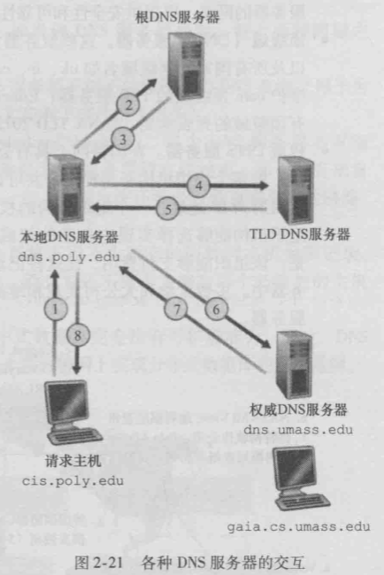

# 计算机网络Chapter2

## Overview

#### 应用程序体系结构

- client-server

- peer-to-peer
  - 自扩展性（self-scalability）
    - 不需要庞大的服务器设施和带宽
  - 任意的端系统都能直接相互联系
  - 只需建立一些连接即可，不需全部建立

#### 进程通信

除了应用层，其余的都有操作系统控制

进行通信实际上是进程（process）

通信方法

- 不同主机之间使用报文（message）进行交互

- 相同的主机使用inter-process communication进行交互

IP：区分不同主机

port number：区分不同进程

提供给应用层的服务

- 数据完整性
  - 保证不会出现数据错误，丢包等操作
- 是否准时
- 吞吐量
- 安全

传输层协议

- 都不能保证吞吐量，延迟

- TCP
  - 接收端的接受速率是一定的，所以发送端的发送速率也是一定的
- UDP
  - 直接发送数据，吞吐量很快

## Web和HTTP

HTML：用来写网页的语言，不是协议

HTTP：是一个网页的协议

HTTP只有两种信息：request和response

网页由对象组成，一个对象就是一个文件

例如：一个web页面包含HTML文本和5个图片，则这个图片通过对象的URL地址来获取（eg：`www.someSchool.edu/picture.gif`）

URL：主机名（host name），路径名（path name）

HTTP只有两种报文：request，response

HTTP

- TCP作为传输协议

- 无状态的（stateless）
  - 不需要关心其之前的请求
  - 对于需要登陆的网站
    - 使用cookies
- 非持续连接（non-persistent HTTP）
  - 在一个连接中，只得到一个对象
  - 同时可以建立多个连接，他们是并行的
  - 快
- 持续连接（persistent HTTP）
  - 一次连接，传输多个对象
  - 节省资源
- 请求报文
  - 请求行（request line）
    - GET方法
      - 代表请求一个对象
    - POST method
      - 发送某个文件
      - 用于提交某个表单，或者输入
    - HEAD方法
      - 类似于GET方法
      - 服务器接收HEAD请求后，会对HTTP报文进行响应，但是不返回请求对象
  - 首部行（head line）
    - Connection：是否使用持续连接
    - User-agent：用户代理，即浏览器的类型
    - Accept-language：发送的语言
- response
  - 首部行（header line）
    - 显示状态码（200，404等）
    - Date：发送响应报文的时间
    - Server：发送报文的服务器名称
    - Last-Modified
    - Content-Length
    - Content-Type
  - 状态行（status line）：
- cookie
  - 用来识别用户的
  - 存在客户端的数据中，其中存放了cookie的识别码
  - cookie的识别码存在后端的数据库中
  - 当客户第一次访问网站，Web就会产生唯一的识别码，存储在数据库中
  - 接下来客户访问网站时，每一次请求都会有携带着cookie
  - 作用
    - 表示一个用户，在没有登陆时建立一个用户会话层
    - 没有隐私
- Web caches
  - 也叫代理服务器（proxy server）
  - 将其中一个服务器放在离客户端很近的地方，作为cache
  - 响应时间就很快
  - 减少流量
- Conditional GET
  - web caches判断网页的内容是否更新
  - 如果更新，就重新接收网页

## E-mail

#### 客户端和服务器之间的通信

SMTP

client process

接收数据的那一方 

server process

发送数据的那一方

#### 服务器和服务器之间的通信

对于客户端发送给服务器，使用SMTP

- 接收方永远在线

对于服务器发送给客户端，使用POP3，IMAP

POP3

- 是一个pull的过程

- 先进行授权：查看账号密码
- 然后就开始transaction
  - 接收信息，删除消息，退出等操作
- 不能创建文件

IMAP

- 在POP3上增加了更多的功能，例如建立邮件文件夹，在文件夹之间移动报文等

对于附件和中文字符，都转换成ASCII，然后传输

通信时，客户端将邮件发送到服务端，服务端将邮件发送到另外一个服务端，然后发送给客户

## HTTP和SMTP的相同点

都是用ASCII编码

### 不同点

HTTP是pull

发送请求后，积极响应 

### HTTP和SMTP的相同点

都是用ASCII编码

### 不同点

HTTP是pull

发送请求后，积极响应 

**客户端有时在线，服务端永远在线**

SMTP是push

主动发送信息

**接收方永远在线**

## DNS

#### Domain Name System

是一个由分成的DNS服务器实现的分布式数据库

一个使得主机能查询分布式数据库的应用层协议

### Domain Name Server

- 用于识别主机，将主机名转换成ip地址
- 主机别名（host aliasing）
  - 访问DNS可以获得主机别名对应的规范主机名以及主机的ip地址
- 邮件服务器别名
- 负载分配

#### root name servers

存放顶级域名的服务器的ip地址

#### local DNS server

存放全部的域名

存放连接该ISP的主机的ip地址

eg：sustech.edu.cn

提供内部的ip地址（ipconfig）

解决外部的响应消息

#### 主机（cis.poly.edu）访问其他主机（gaia.cs.umass.edu）的IP地址流程

- 对于本地的DNS服务器
- 先访问根服务器
- 得到一个具体的DNS服务器地址
- 然后访问这个DNS服务器
- 得到更加具体的DNS服务器
- 依次迭代，从而得到本地DNS服务器
- DNS服务器之间的查询时迭代的（iterated query）
- 主机到DNS服务器之间的查询是递归的（recursive query）

#### DNS caching

在一个请求链中，当某DNS服务器接收一个DNS回答，就会将该回答中的信息缓存在本地存储器中

#### DNS Resource Records

提供了主机名到IP地址的映射

name，value，type，ttl

- ttl
  - 代表该记录的生存时间
  - 过了多久数据就更新，为了保证数据库是实时更新的
- Type
  - A
    - 则Name就是主机名
    - Value代表主机名对应的IP地址
  - NS
    - Name就是一个域
    - Value是知道如何获得该域中主机ip地址的权威DNS服务器的主机名
  - CNAME
    - Value就是别名为Name的主机对应的规范主机名
    - 该记录能够向查询的主机提供一个主机名对应的规范主机名
  - MX
    - Value是名为Name的邮件服务器的规范主机名

主机访问浏览器时，返回的是两条

- 一个是NS，就是访问网站的域名

- 一个是A，包含了ip地址，对于比较大的ISP，相同的域名就会有很多个DNS服务器，也就会有很多个A的记录

type=MX

存储mailserver的名字和ip地址

是一个应用层的协议

