# 计算机网络Chapter3

# 运输层

邮件：数据完整性

视频传输：吞吐量，准时，延迟

协议：TCP，UDP，IP

互联网：TCP/IP协议栈

服务

- 提供了logical communication
  - 不是物理上的通信，不关心中间结点
  - 从应用程序的角度来看，不同的主机好像直连一样
  - 就是将应用层的多个端口整合到一起，看成是一个主机
- app process
  - 实际上主机之间可能有多个进程相互通信
  - 可以认为多个通信进程，传输层负责将网络层的单个包分发

运输层中的分组：segment（报文段）

网络层中的分组：datagram（数据报）

在发送端，将消息分成多个部分

接收端，将这些部分整合到一起

在网络层中，我们只认为是一个通信进程

## multiplexing，demultiplexing

多路复用（multiplexing）

- 将多个包发送到网络层
- 用于发送方

多路分解（demultiplexing）

- 将一个包分成多个包，发放给不同的进程中
- 用于接收方

### demultiplexing

通过协议中不同的端口号，将数据段分发到不同的端口中

此过程不需要识别ip地址

#### connectionless multiplexing

UDP

通过一个二元组来全面标识的，即目的IP地址和目的端口号

如果两个数据包的源IP地址和端口号不同，这两个数据包也会进入同一个socket

只根据destination port number确定

源端口号作为返回地址

#### connection oriented multiplexing

TCP

使用四元组定义一个连接（发送端的ip地址，端口号，接收端的ip地址，端口号）

一个port number会有多个socket

服务器创建连接时，会自己创建一个welcome socket

当接收到客户端的连接请求时，创建一个客户端socket

这些socket中都存在一个port number中

通过这个四元组将数据包分解到socket中

## UDP

独立的处理segment，用于高准时性的应用程序

由于UDP是乱序的，在应用程序中我们需要自己排序

当发现某一个segment是错的，我们也需要处理

没有阻塞控制（可以通过非常快的速度往外发送包）

对于TCP，就一定会有一个流量控制

checksum：用于检测错误，将所有的16位bit加起来，得到和，将进位与最低位相加，取反码即可，如果最后剩下一个byte，就后面补0即可

检测的时候，将所有包16bit加起来，判断结果是否为全1，如果全部为1，代表包无错误

## 可靠的数据传输

TCP是基于不可靠的IP协议经过一系列调整，变得可靠的

输出传输取决于频道的不同

用FSM标识可靠数据传输的过程

rdt代表可靠的传输，udt代表不可靠的传输

在数据传输的过程中，我们都假设空中只存在一个通信的数据包

### rdt1.0

对于理想的状态（信道完全可靠），接收协议解析即可

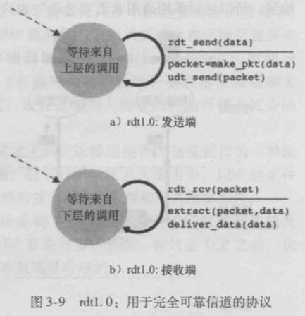

[^Fig.1]: 

对于发送端，调用发送可靠数据`rdt_send(data)`时触发事件，并产生了该数据的分组`packet = make_pkt(data)`，并将分组发送到不可靠的信道中`udt_send(packet)`

对于接收端，收到了可靠的消息后`rdt_rcv(packet)`，就提取数据`extract(packet,data)`，并送到高层`deliver_data(data)`

### rdt2.0

这里假设分组中的bit可能受损，当分组中的bit受损时，接收端检测到受损，并发送消息NAK，否则发送消息ACK（我们这里假设ACK和NAK不会发生受损）

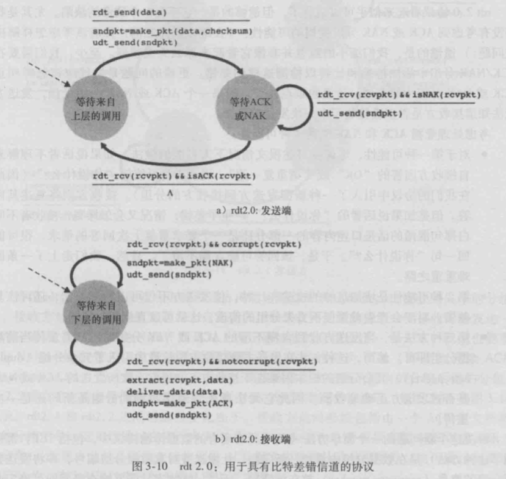

[^Fig.2]: 

对于发送端，发送一个消息后

进入等待ACK或者NAK的模式

- 如果收到了NAK`isNAL(revpkt)`就重新发送
- 如果收到了ACK就进入等待状态继续发送

对于接收端，先进行检测`corrupt(revpkt)`

- 检测失败发送NAK
- 检测成功发送ACK

### rdt2.1

此时考虑ACK或NAK受损，且包乱序

对于包乱序，解决的方法是将发送数据分组的序号（sequence number）放到该字段，接收方只需要检查序号即可血清收到的分组是否需要重传

由于我们这里假设空中只有一个包在传递，所以只需要用一个bit（0或者1）来表示序号即可

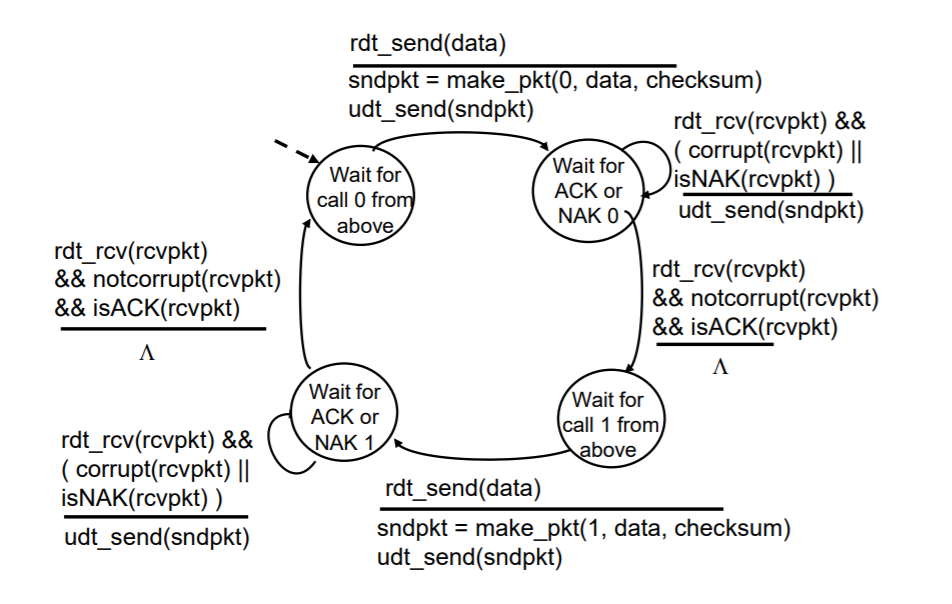

[^Fig.3]: 发送方

由于包会乱序，所以发送端的状态机只是添加了序号，状态数是原来的两倍，唯一的不同在于序号处理的方法不同

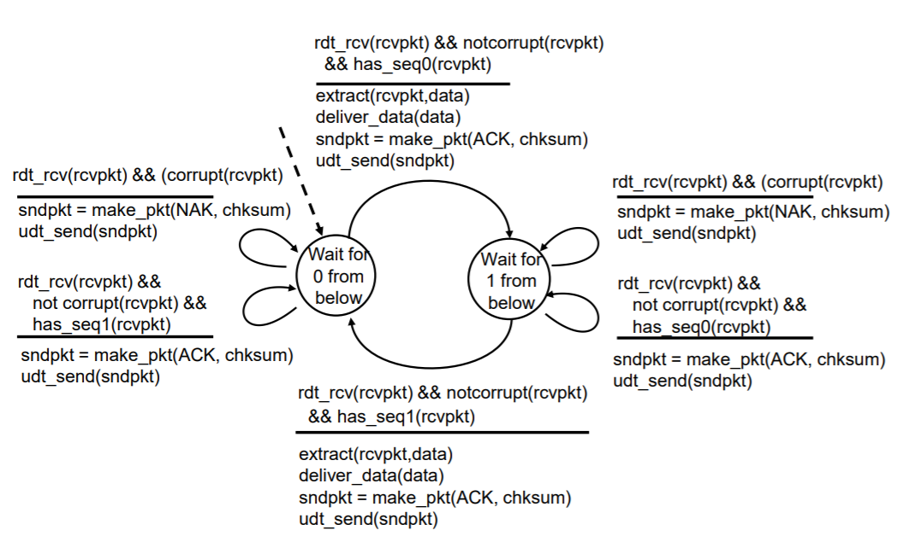

[^Fig.4]: 接收方

对于发送方

- 如果收到了乱序的确认包，就重新发送数据包
- 如果收到受损的分组，重新发送数据包
- 如果收到了乱序的NAK，就重新发送

对于接收方

- 如果收到了乱序的数据包，就发送ACK，使发送方过渡到下一个状态
- 如果收到了受损的数据包，就发送NAK
- 如果收到了正确的数据包，就进入下一阶段，并发送ACK

### rdt2.2

只是rdt2.1的一个优化

不需要两种NAK，实际上，发送ACK0和ACK1就可以代替NAK

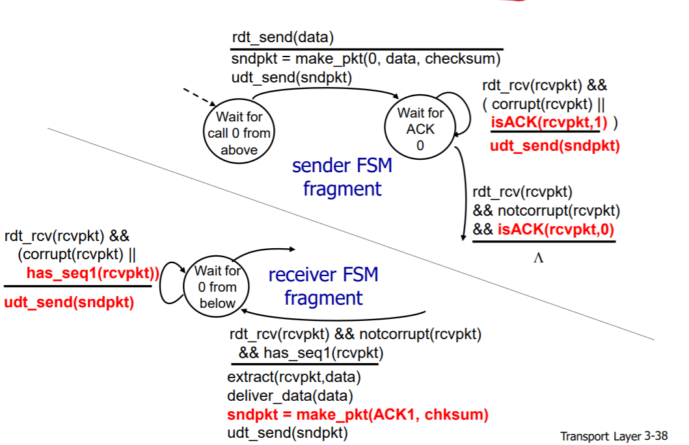

[^Fig.5]: 

### 总结

检测是否有错误，如果有，重新发送请求

error detection

feedback（使用ACK，NAK进行回传）

ACK不会变成NAK，在检测过程中会通不过

如果包是对的，但不是需要的包：发送ACK，使得发送端跳转到另外一个状态

只要corrupt（发现不是需要的包），就会重新发一个包

## 丢包

如果过了很久仍没有收到包，重新发送（超时）

发送方加上了time out

接收方没变

当ACK0丢失时，重新发送，接收方发送的是ACK0，而不是ACK1

如果接收ACK的时间太久，已经TimeOut了，就会导致每一个包发送两遍，扔掉一半的包

### rdt3.0

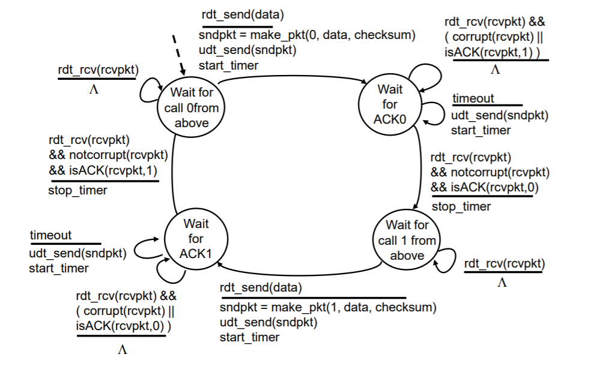

[^Fig.6]: 

接收端同rdt2.2

- 添加了timeout机制
- 发送了第一次包之后，就开启了计时器
- 如果timeout，就重新发送包，并重新开始计时
- 当接收到对应的ACK后，停止计时
- timeout设置
  - 如果timeout设置的太少了，ACK就会在timeout之后到达，就会发生两次重传的缺点
    - timeout应该比传输包的事件快一点
  - 如果timeout设置的太高了，影响同步效率

## 流水线可靠数据传输协议

prop delay是单向的时间

RTT是往返的时间

使用RTT代表包的时间（需要ACK，而不单单是包的传递）

eg：

两个主机之间通信，往返传播时延RTT为30ms，通过一条发送速率R为1Gbps的信道相连，包的长度为8000bit

对于发送端，发送所需要的时间为
$$
t_{\text {trans }}=\frac{L}{R}=\frac{8000 \mathrm{bit} / \mathrm{pkt}}{10^{9} \mathrm{bit} / \mathrm{s}}=8 \mu \mathrm{s} / \mathrm{pkt}
$$
因此，该分组的最后1bit在$t=15.008ms$到达接收方

假设ACK分组很小，则ACK在$t=RTT+L/R=30.008ms$到达发送方

在30.008ms的时间内，发送方只用了0.008ms进行发送

定义利用率utilization为：往返的时间/总时间，即利用率为
$$
U_{\text {ender }}=\frac{L / R}{\mathrm{RTT}+L / R}=\frac{0.008}{30.008}=0.00027
$$
因此，发送方有着非常低的利用率，要想实现比较高的利用率，就要同一时刻发送多个包（pipelining）

既然空中不再只是一个包，就需要增加序号范围，每个传输中的分组必须有多个序号

解决分组的差错恢复有两种基本方法

- 回退N步（Go-Back-N）
- 选择重传（Selective Repeat）

### Go-Back-N

我们假设n为4，就是一个分组同时发送4个包，也就是空中没有发送ACK的包是4个

这种方法假设接收端中没有缓冲

- 接收方必须按照顺序接受包
- 如果收到了乱序的包，接收端就会丢弃

这种方法做了一个保证（cumulative ACK）

- 如果收到了ACKn，意味着n之前的全部包都被正确的接收了

Sender window

- 用于表示发送方的包的各种状态

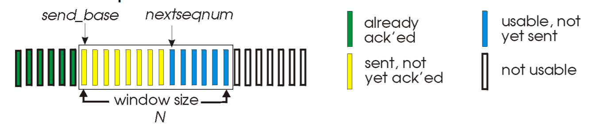

[^Fig.7]: 

定义base为黄色的第一个

nextseqnum为蓝色第一个

如Fig.7，发送端的包有四种状态

- 已经发送完，并接收完了，用绿色表示，此时不在Sender window中
- 目前不在该分组中，就是Sender window还没有移动到那里的包，用白色表示
- 在Sender window中，正在等待ACK的，用黄色表示
- 在Sender window中，还没有发送的，用蓝色表示

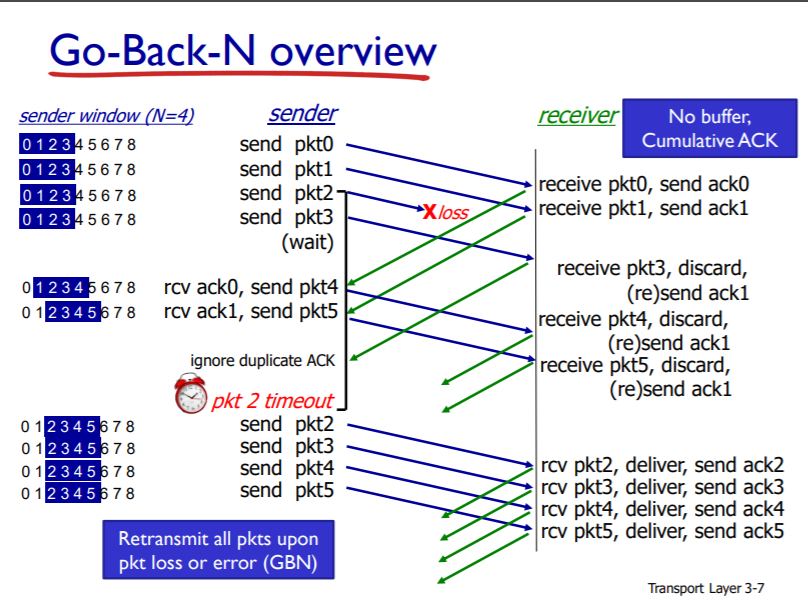

[^Fig.8]: 

如Fig.8

正常情况

- 发送端会依次发送一个分组，里面包含很多个包

- 接收端只能按照包的序号接收，接收完后就发送对应的ACK
- 发送端接收ACK后，Send window就往前一格，并发送下一个分组的包

发送端丢包

- 发送端发出的pkt2丢失
- 接收端原本接受的是pkt2，却收到了pkt3，则舍弃pkt3，发送ACK1（只是正确的收到了pkt1，所以只发送ACK1），重新等待包的发送
- Sender window挪到2时检测到timeout，就重新发送该分组已经发送的包

#### 要点

如果收到了对应的ACK，就发送下一个n的倍数的包

当timeout时，就传输window中所有的包（所以叫Go-Back-N）

如果window是空的（全部都是等待发送的包），就开始计时

如果发生了timeout，则发送的包是黄色的部分，而不是sender window全部

如果收到了ACK，黄色变成绿色

如果等的是ACK0，收到了ACK4，就移动sender window

- receiver保证了只能收到正确的对应顺序的包

对于接收方，如果收到了不同的或者错误的包，就发送之前的ACKn

其FSM如Fig.9，Fig.10

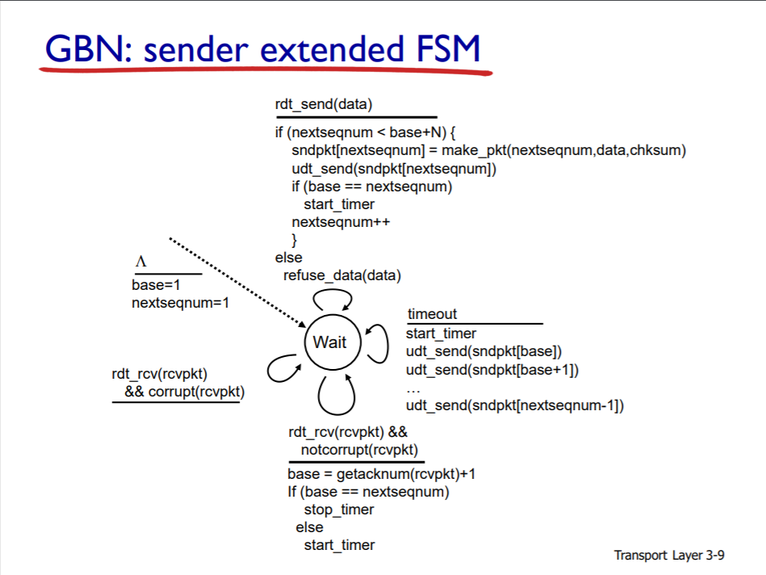

[^Fig.9]: 发送端的FSM

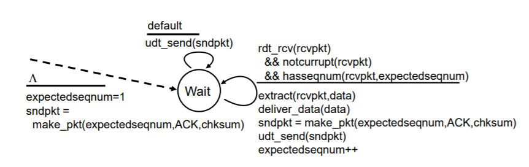

[^Fig.10]: 接收端FSM

缺点：当timeout时就会发送所有未发送的包，就很占用带宽

### Selective repeat

接收方存放一个缓存，timeout时就不需要发送多个包了

sender windows，receiver windows如下所示

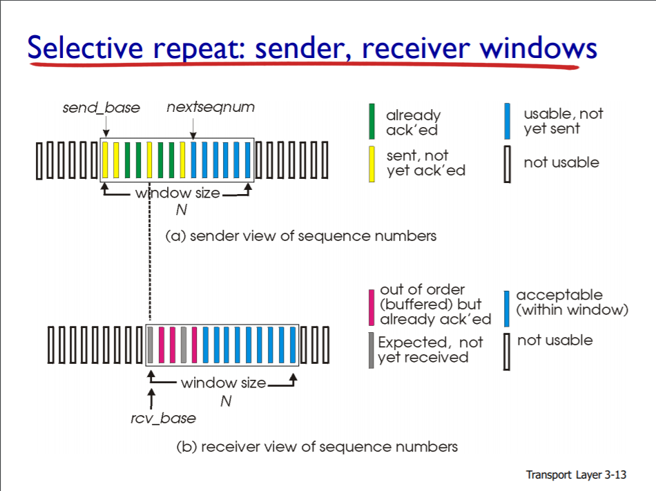

[^Fig.11]: 

Sender window同Go-Back-N

Receiver window有四种状态

- 该分组中还没有接收到的，用蓝色表示
- 不在分组中的，用白色表示
- 在缓存中的，用粉色表示
- 由于丢包等待接收的，用灰色表示（某种程度上，灰色和蓝色相同）

关系如Fig.12

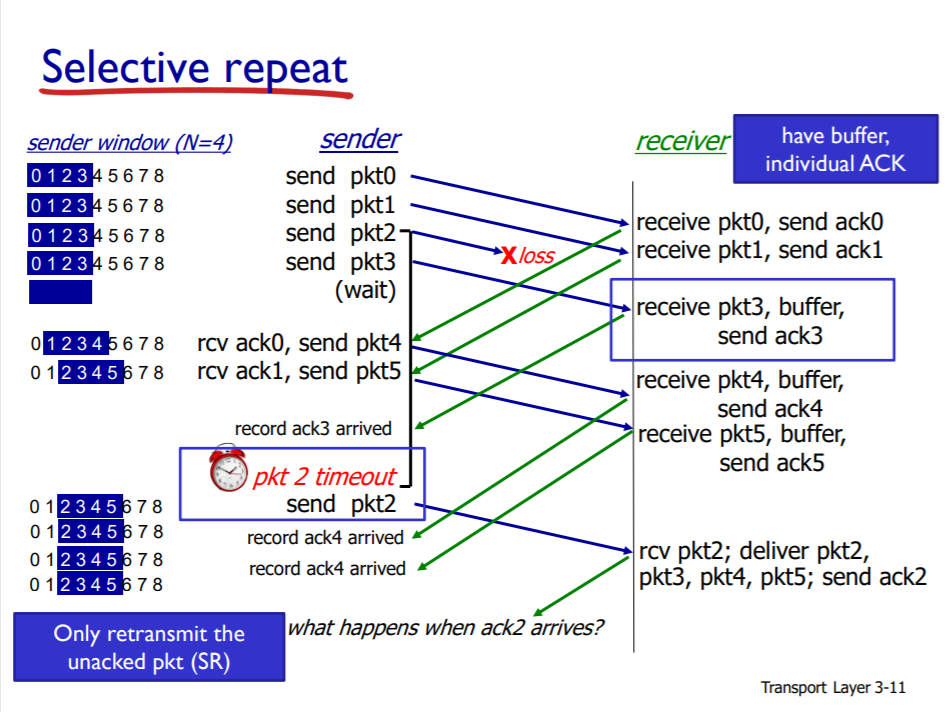

[^Fig.12]: 

正常情况

- 和Go-Back-N类似

发送包丢失

- 接收端没有接收到pkt2，却接收到了pkt3，就把pkt3放到缓存中（pkt4，pkt5同理），并发送ACK3
- 发送端没有收到ACK2，并且过了时间，就发送pkt2
- 接收端收到pkt2，发送ACK2，将存放在缓存中连续的包放到主机中，并将receive window移动到第一个未接受的包
- 发送端收到了ACK2，将send window移动到未收到ACK的第一个包的位置

#### 要点

只有收到了对应的最小的ACK，才能move window

对于发送端，要记住是否收到了sender window中的ACK

对于接收方，如果收到了不在window中的包，就重新发送ACKn，让sender window前进（ACK发送端没有收到）

所以packet number就不能太小，如果发送端没有收到ACK，就会重新发送上一个包中的内容作为该包的内容，从而影响数据完整性

## TCP

一个接收端和发送端

中间路由器对TCP连接完全视而不见

TCP连接提供的是全双工服务（full-duplex service），即双向传输

协议结构如Fig.13

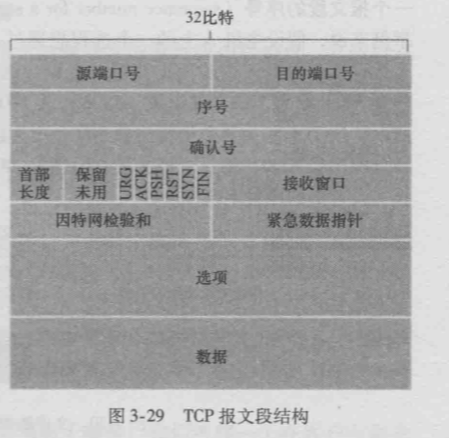

[^Fig.13]: 

### 序号（sqeuence）和确认号（ACK）

TCP中序号表示的是文件传输的为第几个byte（in unit of byte）

ACK也是表示第几个byte（cumulative ack）

- 主机A填充进报文段的确认号是主机A期望从主机B收到的下一字节的序号
- 假设主机A已经收到了来自主机B的编号为0~535的所有字节，同时假设它打算发送一个报文段给主机B。主机A等待主机B的数据流中字节536及之后的所有字节。所以主机A就会在它发往主机B的报文段的确认号字段中填上536
  - 积累确认(cumulative acknowledgment)

使用sequence number（这个包的sequence number）还有ACK number（上一包的ACK number）

双向传输使得在发data的过程中也发ACK，两者合一

#### 例子

客户发给服务器一个字母C，服务器接收到客户的请求后回传给客户C

假设客户和服务器的起始序号（sequence）为42和79，则发送的协议如Fig.14所示

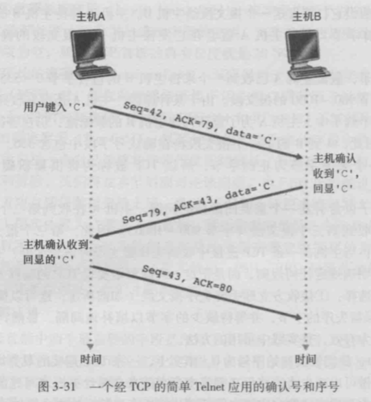

[^Fig.14]: 

### 往返时间的估计与超时

超时的时间间隔必须大于该连接的往返时间RTT，一般的，timeout是根据网络质量估计动态生成的

TCP会在某一时刻测量一个RTT，称为样本RTT（SampleRTT）

由于SampleRTT随机性比较大，所以采用了对SampleRTT取平均的方法，就是不断地进行迭代，公式如下
$$
\text { EstimatedRTT }=(1-\alpha) \cdot \text { EstimatedRTT }+\alpha \cdot \text { SampleRTT }
$$
一般的α取0.125

此外还要计算RTT的偏差DevRTT，也是采用了迭代的方法，公式如下
$$
\text { DevRTT }=(1-\beta) \cdot \text { DevRTT }+\beta \cdot | \text { SampleRTT - EstimatedRTT } |
$$
一般的，β取0.25

则可以得到timeout的值
$$
\text { Timeoutlnterval }=\text { Estimated } \mathrm{RTT}+4 \cdot \text { DevRTT }
$$
一般的，初始Timeout取1

## 要点

TCP没有定义客户是否有缓冲

link会有一个最高的rate，不能超过link提供的rate