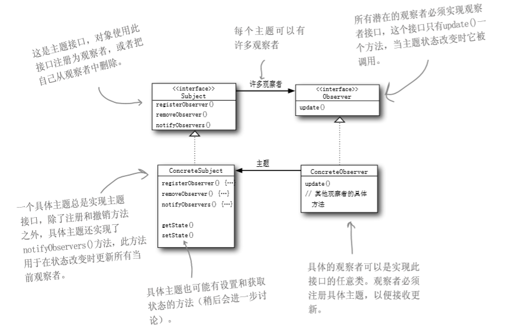
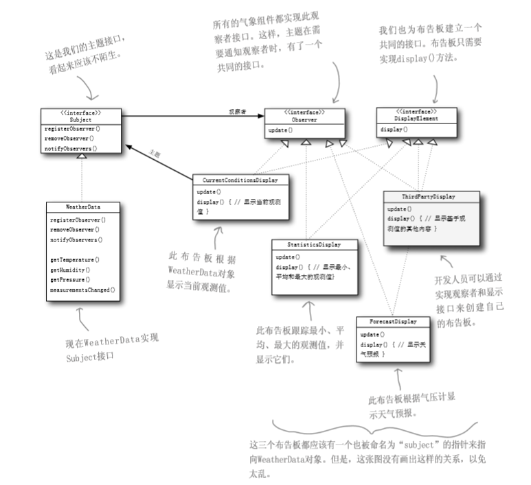
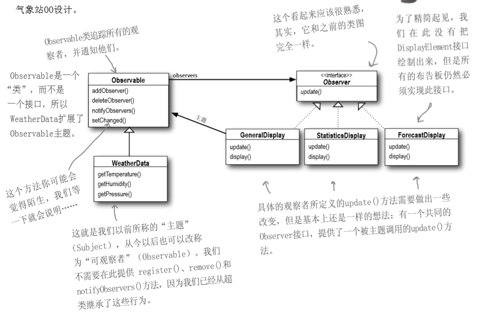

# 面向对象分析与设计_04

## The Obserever Pattern

### 例子

气象检测应用

分为三个部分，气象站（获取实际的气象数据），WeatherData对象（追踪来气象站的数据），布告板（将天气情况呈现给用户）

目标：建立一个应用，利用WeatherData对象取得数据，并更新三个布告板：目前状况、气象统计和天气预报

WeatherData类如下定义

```java
public class WeatherData{
	getTemperature();
	getHumidity();
	getPressure();//用来获取温度、湿度、气压的数据
	measurementsChanged();//用于更新三个布告板
}
```

要求

- 需要实现的是measurementsChanged()
- 此系统必须可扩展，就是用户可以随心所欲地添加或删除任何布告板

一个不好的方法为

```java
public class WeatherData{
	measurementsChanged(){
		float temp = getTemperature();
		float humidity = getHumidity();
		float pressure = getPressure();
		
currentConditionsDisplay.update(temp,humidity,pressure);
		statisticsDisplay.update(temp,humidity,pressure);
		forecastDisplay.update(temp,humidity,pressure);//更新布告栏
	}
}
```

不好的原因在于

- 如果需要增加新的布告栏时，就必须在这里增加方法，这里相当于一个Manager方法。在Manager方法中修改变量会使得代码十分冗余
- `update`方法看起来是一个统一的接口，其参数名都相同，应当进行抽象

### 应用

商用APP中

用户订阅公众号，公众号就会定时推送消息给用户

用户如果取消订阅公众号，他们就不再推送消息

### 具体描述

上述的用户被称为观察者（Observer），公众号被称为主题（Subject）

如果一个对象不是观察者，则对象不会接收到任何消息

如果是观察者，则主题变化时自动通知观察者变化的内容（参数的变化）

**观察者模式定义了对象之间的一对多依赖，这样一来，当一个对象改变状态时，它的所有依赖者都会收到通知并自动更新**

类图如下



[^Fig.1]: 

### 松耦合

主题只知道观察者实现了某个接口（Observer接口）。主题不需要知道观察者的具体类是谁、做了些什么或其他细节

任何时候都可以增加新的观察者。因为主题唯一依赖的东西是一个实现Observer接口的对象列表，所以我们可以随时添加观察者。在运行时我们可以用新的观察者取代现有的观察者，而主题不会受到任何影响（代码不变）

有新类型的观察者出现时，主题的代码不需要修改。只需要在新的类里面实现此观察者接口，然后注册成为观察者对象即可。

对于气象站，类图如下



[^Fig.2]: 

具体代码实现如下

```java
public interface Subject{
	public void registerObserver(Observer o);
	public void removeObserver(Observer o);//增加删除观察者
	public void notifyObservers();//主题状态改变时，通知观察者
}
public interface Observer{
	public void update(float temp,float humidity,float pressure);
	//主题状态改变时，观察者状态也随之改变
}
public interface DisplayElement(){
	public void display();//布告板需要显示时，调用此方法
}
```

```java
public class WeatherData implements Subject{
	private ArrayList observers;
	private float temperature;
	private float humidity;
	private float pressure;
	
	public WeatherData(){
		observers = new ArrayList();
	}
	
	public void registerObserver(Observer o){
		observers.add(o);
	}
	public void removeObserver(Observer o){
		int i = observers.indexOf(o);
		if(i>=0){
			observers.remove(i);
		}
	}
	public void notifyObservers(){
		for(int i=0;i<observers.size();i++){
			Observer observer = (Observer)observers.get(i);
			observer.update(temperature,humidity,pressure);
		}
	}
	public void measurementsChanged(){
		notifyObservers();
	}
	public void setMeasurements(float temperature,float humidity,float pressure){
		this.temperature = temperature;
		this.humidity = humidity;
		this.pressure = pressure;
		measurementsChanged();
	}
}
```

```java
public class CurrentConditionsDisplay implements Observer, DisplayElement{
	private float temperature;
	private float humidity;
	private float pressure;
	private Subject weatherData;
	
	public CurrentConditionsDisplay(Subject weatherData){
		this.weatherData = weatherData;
		weatherData.registerObserver(this);
	}//在构造器中添加该对象为观察者
	
	public void update(float temperature,float humidity,float pressure){
		this.temperature = temperature;
		this.humidity = humidity;
		display();
	}
	
	public void display(){
		System.out.println("温度，湿度，压力。。。。");
	}
}
```

测试程序为

```java
public class WeatherStation{
	public static void main(String[] args){
		WeatherData weatherData = new WeatherData();
		CurrentConditionsDisplay currentDisplay = new CurrentConditionsDisplay(weatherData);
		StatisticsDisplay statisticsDisplay = new statisticsDisplay(weatherData);
		ForecastDisplay forecastDiaplay = new forecastDiaplay(weatherData);
		
		weatherData.setMeasurements(80,80,80);
		weatherData.setMeasurements(81,81,81);
		weatherData.setMeasurements(82,82,82);
		
	}
}
```

pull

指的是观察者在主题状态改变时将数据要回来

用户请求数据的更新（用户不会每天都接收1000多次的天气变化，使用push mode会占用客户端的运行速率）

push

指的是主题在状态改变时主动将数据传给观察者

就是系统直接推送给消息

### Java内置的观察者模式

java.util包内包含最基本的Observer接口与Observable类

让主题（WeatherData）继承自Observable类，观察者使用Observer接口

Observer接口和Observable类包含的方法如下



#### 将对象变成观察者

实现java.util.Observer接口，然后调用addObserver()或者deleteObserver()即可

#### 观察者送出通知

继承自java.util.Observable类

调用setChanged()，表示状态已经改变

- 如果不设置setChanged()，气象台的温度只变化了一点就会推送给观察者

调用notifyObservers()

- notifyObservers()或notifyObservers(Object arg)

观察者接收通知

观察者中实现update(Observable o, Object arg)

- 如果想使用push mode，就将数据对象传给notifyObservers(arg)
- 如果使用pull mode，就使用无参数的notifyObservers
- 对于有参数的notifyObservers，就需要通知重要的数据事件，而可能不是当前的数据，所以用于push mode
- 对于没有参数的notifyObservers，是在观察者模式中调用的，所以直接用主题的数据传递即可

#### 观察者接收通知

观察者中实现update方法即可

update(Observable o, Object arg)

- 第一个参数是主题，代表是哪个主题通知他的
- 第二个参数是传入notifyObservers()的参数，用于push mode

对于WeatherData类，实现如下

```java
import java.util.Observable; 
import java.util.Observer;
public class WeatherData extends Observable {    
    private float temperature;    
    private float humidity;    
    private float pressure;        
    public WeatherData() { }        
    public void measurementsChanged() {        
        setChanged();        
        notifyObservers();    
    }        
    public void setMeasurements(float temperature, float humidity, float pressure) {        
        this.temperature = temperature;        
        this.humidity = humidity;        
        this.pressure = pressure;        
        measurementsChanged();    
    }        
    public float getTemperature() {        
        return temperature;    
    }        
    public float getHumidity() {        
        return humidity;    
    }        
    public float getPressure() {        
        return pressure;    
    } 
}

```

CurrentConditionsDisplay代码如下

```java
import java.util.Observable; 
import java.util.Observer;    
public class CurrentConditionsDisplay implements Observer, DisplayElement {    
    Observable observable;//用来存放主题的引用  
    private float temperature;    
    private float humidity;        
    public CurrentConditionsDisplay(Observable observable) {        
        this.observable = observable;        
        observable.addObserver(this);    
    }        
    public void update(Observable obs, Object arg) {        
        if (obs instanceof WeatherData) {            
            WeatherData weatherData = (WeatherData)obs;            
            this.temperature = weatherData.getTemperature();            
            this.humidity = weatherData.getHumidity();            
            display();        
        }    
    }        
    public void display() {        
        System.out.println("Current conditions: " + temperature             + "F degrees and " + humidity + "% humidity");    
    } 
}
```

