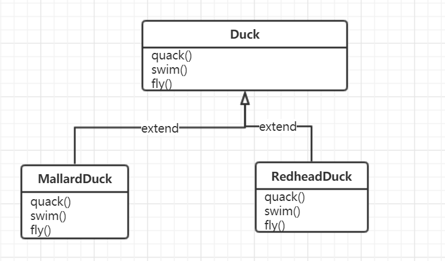
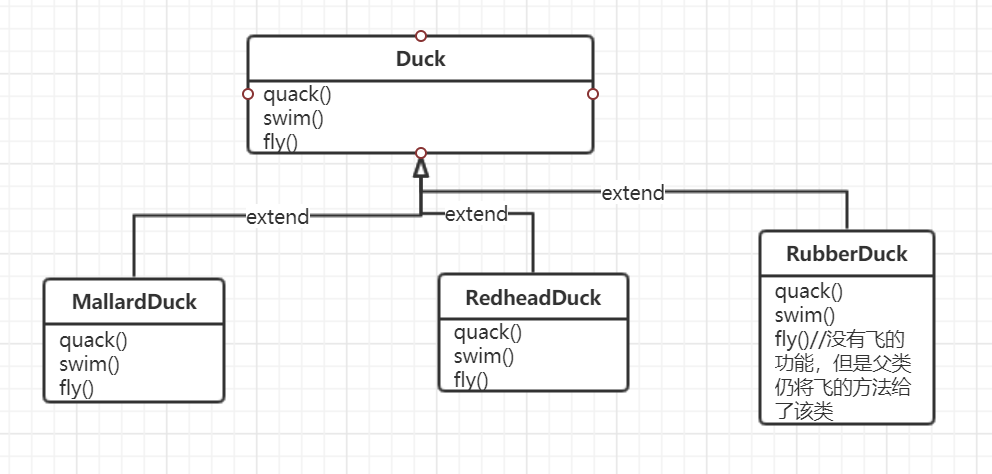
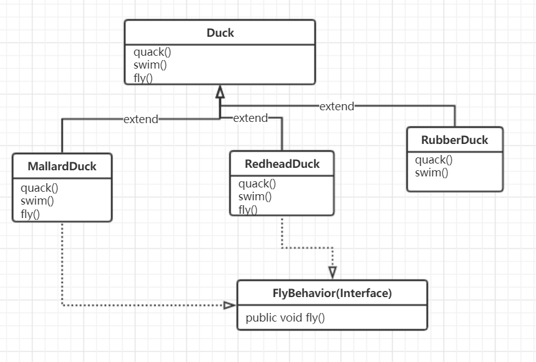
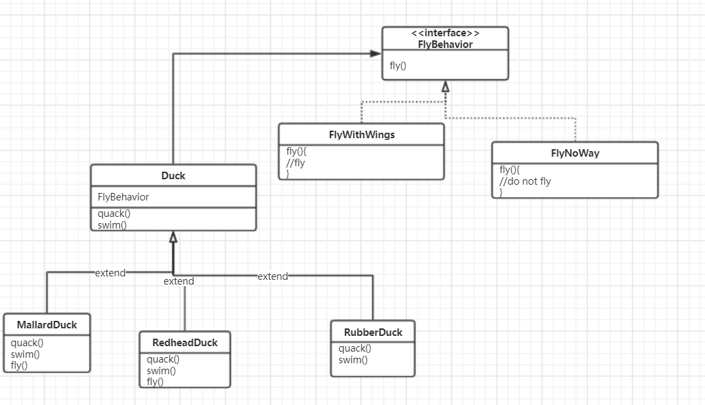

# 面向对象分析与设计_03

## Design Pattern

## The Strategy Pattern

### 意义

提供了设计经验的抽象

提供了一种描述复杂系统的语言

减少系统复杂度

给重构类结构提供了一个方向

### 例子

设计一个关于duck的类，实现三个函数，如图



要求实现鸭子的quack(),swim(),display(),fly()行为

但是对于一些特定的鸭子，比如说RobberDuck，就不会飞，如果直接使用类的继承，就会不太恰当



### Liskov Substitution Principle

#### 问题描述

子类继承自父类

但是子类不具有父类有的方法

#### 解决方法

使用接口，即将fly()这个方法单独设置为一个接口，让能飞的鸭子实现接口的内容



#### Design Principles

将变化的东西封装

在接口中写程序，而不是直接在程序中定义方法

能用composition（association）就不用inheritance（realization）

***

#### 问题描述

如果继承自Duck类的子类数量很多，这样子做就不易于扩展

- 许多类的fly方法都一样，增加了代码的冗余
- 如果要求实现多种fly方法，这样子就不方便管理

#### 解决方法

对于一个接口，添加若干个实现类(CanFly(), CannotFly())

duck类中添加fly的接口



实际的代码为

```java
//鸭子类
public class Duck {
FlyBehavior flyBehavior;
 // more
 public void performFly() {
 flyBehavior.fly();
 }
}
```

```java
//fly的接口及其实现类
public interface FlyBehavior {
 public void fly();
}
public class FlyWithWings implements FlyBehavior{
 public void fly(){
 System.out.println(“FlyWithWings”);
 }
}
public class FlyNoWays implements FlyBehavior{
 public void fly(){
 System.out.println(“FlyNoWays”);
 }
}
```

```java
//各种鸭子类
public class MallardDuck extends Duck {
 public MallardDuck() {
 flyBehavior = new FlyWithWings();
 }
//由于MallardDuck继承自Duck，所以就包含了performFly方法，调用performFly方法时，就相当于调用了FlyWithWings中的Fly方法
 public void display() {
 System.out.println(“I’m a real Mallard duck!”);
 }
}
```

```java
//客户端
public class MiniDuckSimulator {
 public static void main(String[] args) {
 Duck mallard = new MallardDuck();
 mallard.performFly();
 }
}
```

这种实现方法，就是委托（delegates）

***

#### 问题描述

想要相同的鸭子品种实现不同的fly方法，就是动态的调用

#### 解决方法

使用setter函数

在Duck类中添加setFlyBehavior的方法

```java
//鸭子类
public class Duck {
FlyBehavior flyBehavior;
public void setFlyBehavior (FlyBehavior fb) {
 	flyBehavior = fb;
}
 // more
 public void performFly() {
 flyBehavior.fly();
 }
}
```

这样子就能在客户端里面动态的指定一个类中的不同行为

这样就是低耦合

```java
public class MiniDuckSimulator {
 public static void main(String[] args) {
     Duck mallard = new MallardDuck();
     mallard.performQuack();
     mallard.performFly();
     Duck model = new ModelDuck();
     model.performFly();
     model.setFlyBehavior(new
     FlyRocketPowered());
     model.performFly();
 }
}

```

#### 意义

易于扩展

- 对于fly方法，如果想要添加fly方法不同的实现，则添加多个实现类即可解决问题

减少代码的冗余

- 如果只用了一个接口，就会在各种duck类中实现，这样子重构的时候不方便管理和操作

#### 解决的问题

在继承关系中，如果子类有一个方法（fly()）有多种实现形式（flyNoWay(),flyWithWings()），且子类之间可能共用这种方法，则采用Liskov Substitution Principle

#### 要点总结

- 最好是改变某个东西，但是客户端的代码不变

  就是客户不知道内部代码发生了什么变化

  --低耦合

- 动态的改变一个类的特性，使用setter
  
- has-a比is-a好
  
- 使用了接口，对于同一个特性，就能使用不同的应用，便于扩展

## 其他

Grady Booch-UML

Gamma-Eclipse Java

Kent Beck-Junit

Barbora Liskov-数学毕业，搞软工