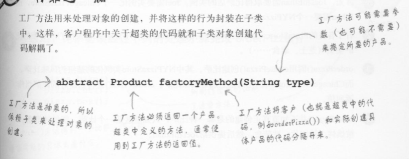

# 面向对象分析与设计_05

对于new关键字，会想到了具体

代码绑着的具体类会缺乏弹性

代码最好不要涉及到太多的具体类

我们更喜欢program in interface

当需要更新的时候，我们更希望在不改动原有代码的情况下添加新东西

## The Factory Pattern

### 例子

假设有一个pizza店，在安排pizza时写的代码格式为

```java
Pizza orderPizza(){
    Pizza pizza = new Pizza();
    pizza.prepare();
    pizza.bake();
    pizza.cut();
    pizza.box();
    return pizza;
}
```

如果需要更多的Pizza类型，代码就变成了

```java
Pizza orderPizza(String type){
    Pizza pizza;
    if(type.equals("cheese")){
        pizza = new ChessPizza();
    }else if(type.equals("greek")){
        pizza = new GreekPizza();
    }else if(type.equals("pepperoni")){
        pizza = new PepperoniPizza();
    }
    pizza.prepare();
    pizza.bake();
    pizza.cut();
    pizza.box();
    return pizza;
}
```

这样子如果增加一份pizza就会在原有代码上进行修改，就不OO

根据将变化的代码封装的原则，先将变化的代码抽离，即

```java
    if(type.equals("cheese")){
        pizza = new ChessPizza();
    }else if(type.equals("greek")){
        pizza = new GreekPizza();
    }else if(type.equals("pepperoni")){
        pizza = new PepperoniPizza();
    }
```

然后创建一个新的对象用来实例化不同的Pizza

这个设计模式叫工厂模式

- 工厂模式用于处理创建不同对象的细节

#### 建立一个简单的Pizza工厂

创建Pizza的工厂类中，代码如下放置

```java
public class SimplePizzaFactory{
    public Pizza createPizza(String type){
        Pizza pizza = null;
        if(type.equals("cheese")){
        	pizza = new ChessPizza();
        }else if(type.equals("greek")){
            pizza = new GreekPizza();
        }else if(type.equals("pepperoni")){
            pizza = new PepperoniPizza();
        }
        return pizza;
    }
}
```

修改客户的代码，得到一个简单的工厂模式

simple factory：新建一个类，创建一个方法CreatePizza（），实现Pizza的定制化

```java
public class PizzaStore{
    SimplePizzaFactory factory;
    public PizzaStore(SimplePizzaFactory factory){
        this.factory = factory;
    }
    
    Pizza orderPizza(String type){
        Pizza pizza;
        pizza = factory.createPizza(type);
        pizza.prepare();
        pizza.bake();
        pizza.cut();
        pizza.box();
        return pizza;
    }
}
```

#### Pizza店扩展

现在要求开设不同的pizza店，每一个Pizza店都售卖不同种类的Pizza

利用SimplePizzaFactory，需要写不同的工厂，分别为NYPizzaFactory、ChicagoPizzaFactory

在客户端中，就写做

```java
NYPizzaFactory nyFactory = new NYPizzaFactory();
PizzaStore nyStore = new PizzaStore(nyFactory);
nyStore.orderPizza("Veggie");
```

现在不同的Pizza店需要有自己的流程，例如加量，加料等

就需要将PizzaStore变成抽象类，且createPizza()变成抽象方法，这样对于不同的store可以实现不同的createPizza方法

```java
public abstract class PizzaStore{
    public Pizza orderPizza(String type){
        Pizza pizza;
        pizza = factory.createPizza(type);
        pizza.prepare();
        pizza.bake();
        pizza.cut();
        pizza.box();
        return pizza;
    }
    
    abstract Pizza createPizza(String type);
}
```

解耦：Pizza对象是抽象的，orderPizza()并不知道那些具体类参与进来了

对于具体的Pizza店，只需要扩展PizzaStore，并重写createPizza()即可

```java
public class NYPizzaStore extends PizzaStore{
    Pizza createPizza(String item){
        Pizza pizza = null;
        if(item.equals("cheese")){
        	pizza = new ChessPizza();
        }else if(item.equals("greek")){
            pizza = new GreekPizza();
        }else if(item.equals("pepperoni")){
            pizza = new PepperoniPizza();
        }
        return pizza;
    }
}
```

更加抽象的来说，对于对象的创建，使用工厂方法来处理对象的创建，并将这种行为封装在子类中，这样客户程序中关于超类的代码就和子类对象创建的代码解耦




factory design pattern是一类设计模式


