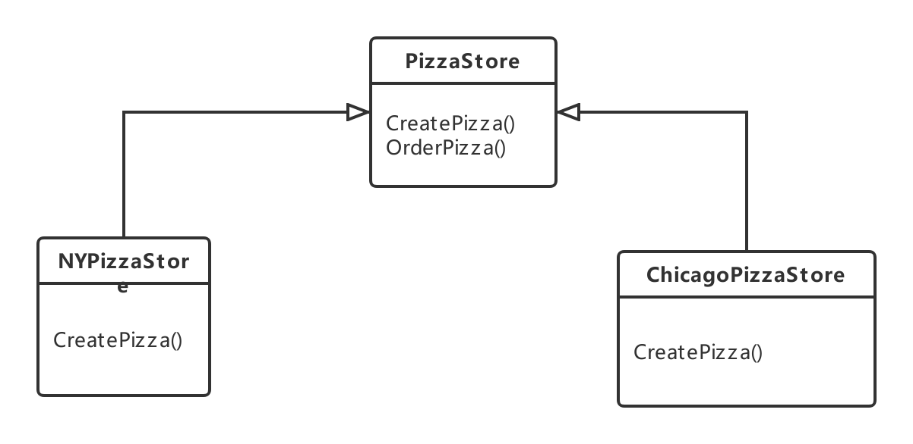
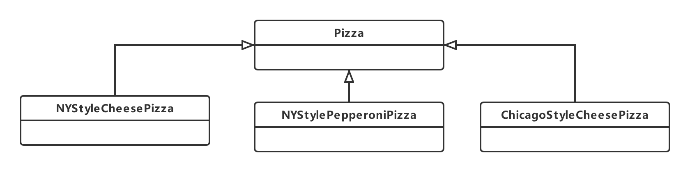
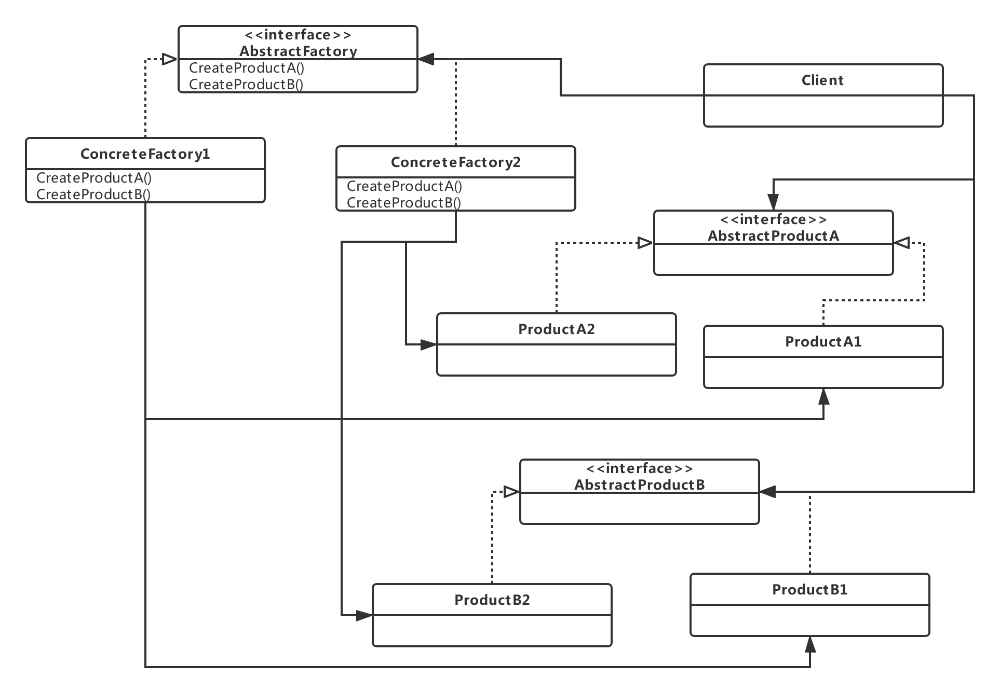

# 面向对象分析与设计_05

对于new关键字，会想到了具体

代码绑着的具体类会缺乏弹性

代码最好不要涉及到太多的具体类

我们更喜欢program in interface

当需要更新的时候，我们更希望在不改动原有代码的情况下添加新东西

## The Factory Pattern

### 例子

假设有一个pizza店，在安排pizza时写的代码格式为

```java
Pizza orderPizza(){
    Pizza pizza = new Pizza();
    pizza.prepare();
    pizza.bake();
    pizza.cut();
    pizza.box();
    return pizza;
}
```

如果需要更多的Pizza类型，代码就变成了

```java
Pizza orderPizza(String type){
    Pizza pizza;
    if(type.equals("cheese")){
        pizza = new ChessPizza();
    }else if(type.equals("greek")){
        pizza = new GreekPizza();
    }else if(type.equals("pepperoni")){
        pizza = new PepperoniPizza();
    }
    pizza.prepare();
    pizza.bake();
    pizza.cut();
    pizza.box();
    return pizza;
}
```

这样子如果增加一份pizza就会在原有代码上进行修改，就不OO

根据将变化的代码封装的原则，先将变化的代码抽离，即

```java
    if(type.equals("cheese")){
        pizza = new ChessPizza();
    }else if(type.equals("greek")){
        pizza = new GreekPizza();
    }else if(type.equals("pepperoni")){
        pizza = new PepperoniPizza();
    }
```

然后创建一个新的对象用来实例化不同的Pizza

这个设计模式叫工厂模式

- 工厂模式用于处理创建不同对象的细节

#### 建立一个简单的Pizza工厂

创建Pizza的工厂类中，代码如下放置

```java
public class SimplePizzaFactory{
    public Pizza createPizza(String type){
        Pizza pizza = null;
        if(type.equals("cheese")){
        	pizza = new ChessPizza();
        }else if(type.equals("greek")){
            pizza = new GreekPizza();
        }else if(type.equals("pepperoni")){
            pizza = new PepperoniPizza();
        }
        return pizza;
    }
}
```

修改客户的代码，得到一个简单的工厂模式

simple factory：新建一个类，创建一个方法CreatePizza（），实现Pizza的定制化

```java
public class PizzaStore{
    SimplePizzaFactory factory;
    public PizzaStore(SimplePizzaFactory factory){
        this.factory = factory;
    }
    
    Pizza orderPizza(String type){
        Pizza pizza;
        pizza = factory.createPizza(type);
        pizza.prepare();
        pizza.bake();
        pizza.cut();
        pizza.box();
        return pizza;
    }
}
```

#### Pizza店扩展

现在要求开设不同的pizza店，每一个Pizza店都售卖不同种类的Pizza

利用SimplePizzaFactory，需要写不同的工厂，分别为NYPizzaFactory、ChicagoPizzaFactory

在客户端中，就写做

```java
NYPizzaFactory nyFactory = new NYPizzaFactory();
PizzaStore nyStore = new PizzaStore(nyFactory);
nyStore.orderPizza("Veggie");
```

现在不同的Pizza店需要有自己的流程，例如加量，加料等

##### 实现流程

就需要将PizzaStore变成抽象类，且createPizza()变成抽象方法，这样对于不同的store可以实现不同的createPizza方法

```java
public abstract class PizzaStore{
    public Pizza orderPizza(String type){
        Pizza pizza;
        pizza = factory.createPizza(type);
        pizza.prepare();
        pizza.bake();
        pizza.cut();
        pizza.box();
        return pizza;
    }
    
    abstract Pizza createPizza(String type);
}
```

解耦：Pizza对象是抽象的，orderPizza()并不知道那些具体类参与进来了

对于具体的Pizza店，只需要扩展PizzaStore，并重写createPizza()即可

```java
public class NYPizzaStore extends PizzaStore{
    Pizza createPizza(String item){
        Pizza pizza = null;
        if(item.equals("cheese")){
        	pizza = new NYStyleChessPizza();
        }else if(item.equals("greek")){
            pizza = new NYStyleGreekPizza();
        }else if(item.equals("pepperoni")){
            pizza = new NYStylePepperoniPizza();
        }
        return pizza;
    }
}
```

使用工厂方法来处理对象的创建，并将这种行为封装在子类中（将工厂方法变成抽象的方法，或者抽象成工厂类）。这样客户程序中关于超类的代码就和子类对象创建的代码解耦


对于Pizza类，使用继承的方式即可

```java
public abstract class Pizza{
    String name;
    String dough;
    String sauce;
    ArrayList toppings = new ArrayList();//存放配料
    void prepare(){print(xxx)}
    void bake(){print(xxx)}
    void cut(){print(xxx)}
    void box(){print(xxx)}
    public String getName(){return name;}
}
```

对于子类，代码为

```java
public class NYStyleCheesePizza extends Pizza{
    public NYStyleCheesePizza(){
        name = "NY Style Sauce and Cheese Pizza";
        dough = "xxx";
        sauce = "xxx";
        toppings.add("xxx");
    }
}
```

这样，在客户端中表示为

```java
public static void main(String[] args){
    PizzaStore nyStore = new NYPizzaStore();
    PizzaStore chicagoStore = new ChicagoPizzaStore();
    
    Pizza pizza = nyStore.orderPizza("cheese");
    System.out.println("Ehtan ordered a " + pizza.getName());
    
    pizza = chicagoStore.orderPizza("cheese");
    System.out.println("Joel ordered a " + pizza.getName());
}
```

这样就可以实现不同地区不同种类Pizza的订制

#### 总结

工厂方法模式（Factory Method Pattern）让子类决定该创建的对象是什么，来达到将对象创建的过程封装的目的

创建对象分为两大类

创建者（Creator）类



- PizzaStore类为抽象类，定义了一个抽象的方法CreatePizza()
- 抽象的产品由子类制造，创建者不需要真的知道在制造哪种具体产品
- NYPizzaStore和ChicagoPizzaStore为具体的创建者，使用CreatePizza()创建自己风味的Pizza

产品类



- 工厂生产的产品，对PizzaStore来说，产品就是Pizza
- 具体的产品的出产在子类中实现

### 工厂方法及设计原则

工厂方法模式定义了一个创建对象的接口，但由子类决定要实例化的类是哪一个。工厂方法让类把实例化推迟到子类

- 能帮助我们将产品的“实现”从“使用”中解耦

要依赖抽象，不要依赖具体类

变量不可以持有具体类的引用

- 关于具体类，少用new

不要让类派生自具体类

- 不要依赖具体类

- 如果派生自具体类，不如改成一个抽象类或者一个接口

不要覆盖基类中已实现的方法

- 基类中已实现的方法，应该有所有的子类共享

### 抽象工厂

不同的Pizza店，需要不同的原料

现在需要描述不同原料的创造过程

定义一个工厂（接口），来生产原料

```java
public interface PizzaIngredientFactory{
    public Dough createDough();
    public Sauce createSauce();
    public Cheese createCheese();
    public Veggies[] createVeggies();
    public Pepperoni createPepperoni();
    public Clams createClam();
}
```

则创造原料的工厂类为

```java
public class NYPizzaIngredientFactory implements PizzaIngredientFactory{
    public Dough createDough(){
        return new ThinCrustDough();
    }
    public Sauce createSauce(){
        return new MarinaraSauce();
    }
    public Cheese createCheese(){
        return new ReggianoCheese();
    }
    public Veggies[] createVeggies(){
        Veggies veggies[] = {new Garlic(),new Onion()};
        return veggies;
    }
    public Pepperoni createPepperoni(){
        return new SlicedPepperoni();
    }
    public Clams createClam(){
        return new FreshClams();
    }
}
```

所以Pizza类改成

```java
public abstract class Pizza{
    String name;
    Dough dough;
    Sauce sauce;
    Veggies veggies[];
    Cheese cheese;
    Pepperoni pepperoni;
    Clams clam;
    
    abstract void prepare();//收集Pizza的原料，不同的子类有不同的实现方法
    void bake(){print(xxx)}
    void cut(){print(xxx)}
    void box(){print(xxx)}
    void setName(String name){this.name = name;}
    String getName(){return name;}
}
```

Pizza的实现类中写

```java
public class CheesePizza extends Pizza{
    PizzaIngredientFactory ingredientFactory;
    public CheesePizza(PizzaIngredientFactory ingredientFactory){
        this.ingredientFactory = ingredientFactory;
        //将工厂存在一个实例变量中
    }
    void prepare(){
        print("preparing");
        dough = ingredientFactory.createDough();
        sauce = ingredientFactory.createSauce();
        cheese = ingredientFactory.createCheese();
    }
}
```

引入原料工厂使得Pizza和区域原料之间被解耦，Pizza类根本不关心这些原料，他只知道如何制作Pizza即可

对于PizzaStore的具体类，修改为

```java
public class NYPizzaStore extends PizzaStore{
    protected Pizza createPizza(String item){
        Pizza pizza = null;
        PizzaIngredientFactory ingredientFactory = new NYPizzaIngredientFactory();
        if(item.equals("cheese")){
            pizza = new CheesePizza(ingredientFactory);
            pizza.setName("New York Style Cheese Pizza");
        }else if(item.equals("veggie")){
            pizza = new VeggiePizza(ingredientFactory);
            pizza.setName("New York Style Veggie Pizza");
        }else if(item.equals("clam")){
            pizza = new ClamPizza(ingredientFactory);
            pizza.setName("New York Style Clam Pizza");
        }else if(item.equals("pepperoni")){
            pizza = new CheesePizza(ingredientFactory);
            pizza.setName("New York Style Pepperoni Pizza");
        }
        return pizza;
    }
}
```

抽象工厂模式：提供一个接口，用于创建相关或依赖对象的家族，而不需要明确指定具体类



抽象工厂定义了一个接口，所有的具体工厂都必须实现此接口，这个接口包含一组方法用来生产产品

客户不需要实例化产品对象，只需要使用其中一个工厂创建产品即可

抽象工厂只是定义创建一组产品的接口，接口中的每个方法负责创建一组产品

上图的Product指的是一个产品家族，在Pizza中，可以代表不同种类的dough，sauce，cheese 

### 抽象工厂和工厂方法的对比

工厂方法产生的Pizza店只能实例化当地的Pizza

抽象工厂在此基础上进行了解耦，即将原料细分，也就实现了不同

factory design pattern是一类设计模式


