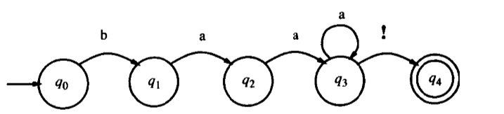
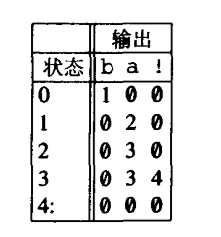
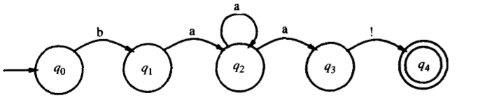
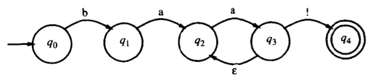

# 自然语言处理综述第二章

## 正则表达式（regular expression）

用来刻画符号串集合的一个代数表述

字符的组合
- 区分大小写
- 使用`[]`代表或
  - `/[wW]/`代表匹配的字符串中要么包含w，要么包含W
- 使用`^`代表不出现某个单独的字符
  - `/[^a]/`代表与任何不包含a的单个字符相匹配
- 使用`？`代表前一个字符或无
  - `/woodchucks?/`代表`woodchuck`或者`woodchucks`
- 使用`*`代表前面紧邻的字符出现零次或连续出现若干次
  - `/a*/`代表出现0次或者若干个a
  - 一个整数的正则表达式为`/[0-9][0-9]*/`
- 使用`Kleene+`代表前面的字符会出现一个或者多个
  - 整数的正则表达式为`/[0-9]+/`
- 使用`/./`代表一个通配符，表示任何与单个字符（回车除外）相匹配的字符
- 锚号
  - `^`
    - `/^The/`代表The只出现在一行的开始
  - `$`
    - 表示一行的结尾
    - `/^The dog\.$/`代表仅包含短语*The dog*这一行。使用反斜杠表示"."是一个句号，而不是通配符
  - `\b`代表词界，`\B`代表非词界
    - `/\bthe\b/`代表the，不能代表other

- 字符的组合
  - `|`代表词中的或
    - `/cat|dog/`代表cat或者dog
  - 使用`（）`设置优先级
    - `/gupp(y|ies)/`代表字符串guppy或者guppies
- 当一个pattern可以和多个字母进行配对时，正则表达式应该总是尽其可能的与其中最长的符号串相匹配
- 高级算符
  - `\d`任何数字字符
  - `\D`任何非数字字符
  - `\w`任何字母数字字符或空白
  - `\W`一个非字母数字字符
  - `\s`空白区域（包括\t\r等）
  - `\S`非空白区域
  - `/{n,m}/`代表前面的字符或者表达式出现了n到m个
  - `/{n,}/`代表前面的字符或者表达式出现了至少n个
  - `/{n}/`代表查找正好由n个字符串的字符
    - `/a\.{24}z/`代表a后面跟着24个"."，再跟着一个z
- 替换
  - 将文本中所有的整数两侧加上尖括号
    - the 35 boxes变成the <35> boxes
    - 对应的整的`/([0-9]+)/<\1>/`
    - 中间的`/`代表替换`<\1>`代表与用圆括号中的项相匹配的符号来替换
      - 同样的，使用`\2`代表第二个圆括号中相匹配的符号
      - 这样的被称为寄存器（register）

最早的自然语言理解程序中就是使用了关键词来进行替换，从而达到智能的感觉

## 有限状态自动机（FSA）

有限状态自动机和正则表达式是一一对应的关系

初始状态（start state），最后状态（final state），转移（transition）

Q：N中状态q_0,q_1...q_N的有限集合

Σ：有限的输入符号字母表

q_0：初始状态

F：终极状态的集合，F包含于Q

δ（q，i）：状态之间的转移矩阵

对于上述自动机，Q={q_0，q_1，q_2，q_3，q_4}，Σ={a，b，！}，F={q_4}

δ（q，i）为

形式语言（formal language）

- 能够生成或识别某一形式的字符串
- 使用L（m）表示由m刻画的形式语言，上述自动机表述的形式语言就是无限集合L（m）={baa!,baaa!,baaaa!....}
- 使用形式语言来模拟音系，形态，句法

### 有限状态自动机

#### 非确定FSA（NFSA）

- 由于自反圈的限制，在走到某一步时产生了歧义，即不知道走向哪一个状态

例如上图，就不知道在q_2时如果输入a就不知道是走到q_2还是q_3

- 包含了ε-转移的新弧

  

ε-转移：如果到达了状态3，可以不看输入带子上的符号就转移到状态2，或者向前推进输入指针

#### 解决NFSA的不确定性问题

- 回退（backup）
  - 走到选择点时，做记号。如果发现选择错误，就退回去
  - 在每一个选择的点上必须记住每一个选择
  - 对于每一个不同的选择必须存储够足够的信息
    - 机器将进入的状态和结点
    - 输入带子上对应的位置
    - 识别算法的搜索状态（search-state）
    - 此时自动机的状态为机器状态（machine-state）
  - 在状态矩阵中加一个ε的列
- 前瞻（look-ahead）
  - 在输入中向前看，从而确定是哪一条路径
- 并行（parallelism）
  - 并行的查找每一条不同的结果

ND-RECOGNIZE算法

- 状态空间搜索算法（state-space search）

#### NFSA和DFSA的关系

对于任何NFSA，都存在一个完全等价的DFSA，使用并行算法即可解决这个问题

#### 正则语言和FSA

正则语言：由FSA刻画的字符串的集合

如果L_1，L_2都是正则语言，则L_1，L_2的交差补逆都是正则语言

