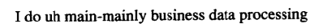
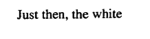

# 自然语言处理综述第六章

预测下一个单词很重要，这样可以用来检查语法错误

## N元语法模型

使用前面的N-1个单词预测第N个

使用语言模型（language model）和语法（grammar）进行预测

### 语料库中单词数目的计算

自然语言的统计处理依赖于语料库（corpora）

标点符号算不算取决于不同的任务

文本语料库有标点符号

口语语料库通常没有标点符号

- 例如

- main-mainly就存在着片断（fragment）
- uh就是有声停顿（filled pause），会当成一个单词来处理
- 对于大写和非大写，应该把它们混在一起来对待
- 对于单词的屈折形式（例如cats和cat），很多时候都看成同一个抽象单词或者词目（lemma）的实例
- 型（type）表示语料库中所有的单词数目，例（token）表示不重复的单词数目

### 简单的N元语法

#### 最简单的单词序列模型

- 假定语言中的任何一个单词后面可以跟随该语言中的任何一个单词

- 如果英语中有100 000个单词，那么任何一个单词后面的其他任何单词的概率就是1/100 000

#### 二元语法模型

通过对一个语料库中的单词频度进行统计得出结论

例如，the的频度有7%，则the的概率就是0.07

但是，对于下面的符号串

显然是跟一个名词比较合理（例如rabbit）

因此，我们还要看单词对于给定的前面一个单词的条件概率

- 当前面是white是rabbit的概率要高于当前面是其他单词是rabbit的概率

将单词串表示为$w_{1} \cdots w_{n}$，或者表示为$w_{1}^{n}$

因此，我们需要计算的是$P\left(w_{n} | w_{1}^{n-1}\right)$

由链式法则我们有

$$\begin{aligned} P\left(w_{1}^{n}\right) &=P\left(w_{1}\right) P\left(w_{2} | w_{1}\right) P\left(w_{3} | w_{1}^{2}\right) \ldots P\left(w_{n} | w_{1}^{n-1}\right) \\ &=\prod_{k=1}^{n} P\left(w_{k} | w_{1}^{k-1}\right) \end{aligned}$$

但是，当前面给定的单词序列很长时，这样的计算过于复杂

于是，想到了使用二元语法模型（bigram model）

- 使用$P\left(w_{n} | w_{1}^{n-1}\right)$，来逼近$P\left(w_{n} | w_{n-1}\right)$
- 就是说，我们使用$P(\text { rabbit } | \text { a })$来逼近$P(\text { rabbit } | \text { Just the other day I saw a })$

马尔可夫假设

- 一个单词的概率只依赖于它前面单词的概率

- 可以看成是每一个单词只有一个状态的马尔科夫链

- N元语法模型成为N-1阶马尔可夫模型

- N元语法对下一个单词的条件概率逼近的通用等式为
  $$
  P\left(w_{n} | w_{1}^{n-1}\right) \approx P\left(w_{n} | w_{n-N+1}^{n-1}\right)
  $$

  - 理解为二元语法模型等价为前面的n-1个单词都相同，并重复n-1次
  
  - 带入上式链式法则，得到
    $$
    P\left(w_{1}^{n}\right) \approx \prod_{k=1}^{n} P\left(w_{k} | w_{k-1}\right)
    $$
  
  - （2）式指的是对一个完整句子的预测，通过两两单词相乘得到
  
- 当预测一个句子的出现概率时，需要将单词的配对两两相乘，此时概率在计算机表示中就可能产生了溢出

  - 对每个概率取对数
  - 把所有对数相加代替线性空间的相乘
  - 再取结果的反对数
  - 一般的，都是以2为底

求得$P\left(w_{n} | w_{n-1}\right)$的方法

- 使用训练语料库和归一化的方法得到

- 从语料库中取某个特定的二元语法的计数，然后用第一个单词相同的二元语法的总数除以这个计数
  $$
  P\left(w_{n} | w_{n-1}\right)=\frac{C\left(w_{n-1} w_{n}\right)}{\sum_{w} C\left(w_{n-1} w\right)}
  $$

- 化简，得
  $$
  P\left(w_{n} | w_{n-1}\right)=\frac{C\left(w_{n-1} w_{n}\right)}{C\left(w_{n-1}\right)}
  $$

- 对于一般的N元语法，参数估计为
  $$
  P\left(w_{n} | w_{n-N+1}^{n-1}\right)=\frac{C\left(w_{n-N+1}^{n-1} w_{n}\right)}{C\left(w_{n-N+1}^{n-1}\right)}
  $$

- 这个估计值只是一个近似，即看作为概率

由于不同的语料库会产生不同的结果（同样是英语，不同人的说话方式不一样，训练后所生成的句子也会不一样），所以要把数据分为训练集和测试集

#### 平滑

每一个特定的语料库训练出来的二元语法矩阵都是稀疏的

- 通过技术使得“零概率的二元语法”指派非零概率
- 使他们变得平滑

##### 加1平滑

非平滑的一元语法是用单词的例（type）的总数N除单词数来计算的
$$
\begin{aligned} P\left(w_{x}\right) &=\frac{c\left(w_{x}\right)}{\sum_{i} c\left(w_{i}\right)} \\ &=\frac{c\left(w_{x}\right)}{N} \end{aligned}
$$
加1平滑顾名思义，就是对一些不会出现的数加1从而变得可能出现

这里调整的是c，也就是统计的数量

对于每一个单词的统计数量c，采用以下转化方式，V指的是这个句子的型（语料库中不重复的单词的数量）
$$
c_{i}^{*}=\left(c_{i}+1\right) \frac{N}{N+V}
$$
这样概率就变成了$p_{i}^*$

另外一种表示方法为令$d_{c}=\frac{c^*}{c}$，其中$d_{c}$称为打折（discount）

由此可得$p_{i}^{*}=\frac{c_{i}+1}{N+V}$

对于二元语法，则为
$$
p^{*}\left(w_{n} | w_{n-1}\right)=\frac{C\left(w_{n-1} w_{n}\right)+1}{C\left(w_{n-1}\right)+V}
$$
这样的方法产生的效果还不如不使用平滑的方法

##### Witten-Bell打折法

把零频度N元语法看成是首次看一个N元语法的概率来模拟

就是使用刚才已经看过一次的事物的数量来帮助估计从来没有见过的事物的数量

- 规定从来没有出现过的单词或语法，他们的概率总和为

$$
\sum_{i : c_{i}=0} p_{i}^{*}=\frac{T}{N+T}
$$

- 其中，T代表“型”的数量，N代表“例”的数量

