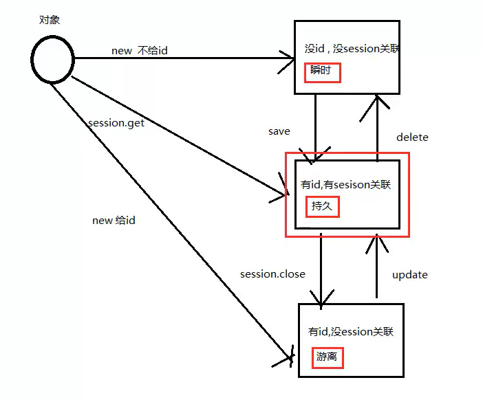

# Hibernate_03

## API

#### Configuration 

使用了configure()后才算进行了读取

读取的是hibernate.cfg.xml

#### SessionFactory

用于创建session对象

消耗内存资源大

线程安全

一个web项目中只创建一个

#### Session

save()，update()，get()，delete()用来增删改查

### 创建实体

提供无参的构造器

提供属性

- 成员变量私有化
- 提供getset方法

尽量使用包装类型

需要有主键

不要加final(hibernate中使用代理机制)

### 对象的三种状态

瞬时状态

- 实体
- 无id
- 没有与session关联

持久化状态

- 实体
- 有id
- 与session关联
- **持久化状态的任何改变都会同步到数据库中**

游离态

- 实体
- 有id
- 没有与session关联

与session关联指的是与session发生了交互

当session关闭时，变成游离态

**将我们希望同步到数据库中的数据变成持久化状态**

SaveOrUpdate()

- **无脑将对象变成持久化状态**

## 关联实体的方法

本质：对象状态的转换

将瞬时状态变为持久

目的：生成id

与session有关联的都有id

## 缓存的存在

hibernate先会去session缓存中寻找id值一样的对象，如果找到了，直接返回此对象，如果没找到，再用sql查询

用于提高操作效率

不同session会使用不同的缓存

## 事务

#### 性质

- 原子性
  - 一个操作不能分为两个更小的操作
  - 要么全执行完，要么全不执行
- 一致性
  - 事务在完成时，必须使得所有的数据保持一致的状态(与开始事务前保持一致的状态)
- 隔离性
  - 事务查看数据时数据所处的状态，要么是另一个并发事务修改它之前的状态，要么是另一并发事务修改它之后的状态，事务不会查看中间状态的数据
  - 一个事务都是从头到尾执行完再执行另外一个事务
- 持久性
  - 事务操作之后，他对于系统的影响是永久性的（执行就执行了，没有撤回）

#### 隔离级别

- 脏读
  - 读取了未提交事务中的数据

- 不可重复读
  - 对于数据库中的某个数据，一个事务范围内多次读取同一个数据，却有不同的值
  - 读取了已提交事务的数据

- 幻读
  - 修改后的数据和预期的值不一致

#### 配置事务的隔离级别

- 读未提交
  - 最低的隔离级别
  - 最没用
  - 最快

- 读已提交
  - 可避免脏读
  - 不能避免不可重复读
- 可重复读
  - 可以避免可重复读
  - 可以避免脏读
- 串行化
  - 三种都能避免
  - 最慢

### 要点

对于进行操作的部分，最好是将操作数据的部分放入try-catch语句块中