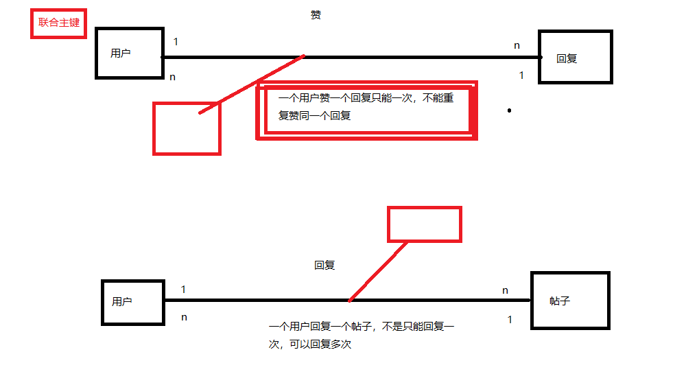

# 论坛项目_01

### 要点

将用户发帖的内容设置为两行，其余的设置成省略号

文本样式设置

```html
<div class="qContent" style="width: 630px; height: 34px; overflow: hidden; white-space: normal; text-overflow: ellipsis;">
    <p>
        <s:property value="#paste.content" />
    </p>
</div>
```

### 联合主键

对于用户和回复的点赞关系，一个用户可以点赞多个回复，一个回复可以被多个用户点赞

但是，一个用户赞一个回复只能赞一次，不能重复赞同一个回复

就引入联合主键



使用userid和answerid作为主键，生成一个点赞表

- 这样一个用户就只能点赞一个回复一次